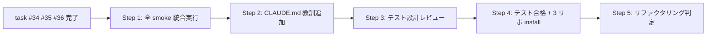

<!--
# 採用 6 条 (Task=Phase=N Step、2026-05-25 採用) metadata
total_steps: 5
-->

# Task #37: list-md plan-first 統合 + CLAUDE.md Critical Lessons 教訓追加

> Status: **🔲 未着手** (2026-05-25 起案、task #34+#35+#36 完了後着手予定)
> 起案: 2026-05-25 (task #33 分割、旧 Phase 5)
> 関連: #33 (継承元 task)、#34/#35/#36 (兄弟分割 task、依存先)
> 設計起源: [`docs/draft/list-md-plan-first-normative.md`](../draft/list-md-plan-first-normative.md) §3 統合 + CLAUDE.md 教訓追加

## Task ゴール

task #33-#36 で実装された全 hook + helper の統合 smoke が PASS し、CLAUDE.md Critical Operational Lessons に「list.md plan-first 不在 → SessionStart hook + Write warn 2 段検出」教訓が HIGH 級として追加される (観察可能: `grep -q "list.md plan-first" CLAUDE.md` exit 0、`grep -A 2 "list.md plan-first" CLAUDE.md | grep -q "HIGH"` exit 0)。

## Task 作業概要

- 全 hook + helper + smoke の統合実行 (task #34 + #35 + #36 の smoke 全 PASS 確認)
- 既存 smoke regression 0 件 (task-rule-guard / workflow-guard / next-actions-hooks / loop-auto-progress 等 全件)
- CLAUDE.md Critical Operational Lessons に HIGH 級教訓追加
- 再発防止 action 1 行以上記載 (Phase 3 + 4 機械検出言及)
- 3 リポ user manual install 反映確認 (recall_poc / taskManageSystem / classlab-weekly-news)

## Task 完了条件 (DoD)

- [ ] task #34 + #35 + #36 完了確認 (本 task 依存)
- [ ] 全 hook + helper + smoke 統合実行で PASS
- [ ] 既存 smoke regression 0 件
- [ ] CLAUDE.md 教訓追加 (`grep -q "list.md plan-first" CLAUDE.md` exit 0)
- [ ] 教訓 entry が HIGH 列に分類 (`grep -A 2 "list.md plan-first" CLAUDE.md | grep -q "HIGH"` exit 0)
- [ ] 再発防止 action 1 行以上記載 (`grep -A 5 "list.md plan-first" CLAUDE.md | grep -qE "(再発防止|prevention|task #35|task #36)"` exit 0)
- [ ] 5+ reviewer 全 approve (Step 3 テスト設計レビュー)
- [ ] リファクタリング 3 観点判定済 (Step 5)
- [ ] 3 リポ user manual install 反映確認 (Step 4 cross-repo)
- [ ] commit 完了 (push は user manual)

## Task 概要欄 (list.md 用、3 要素規範)

task #33-#36 の plan-first 規範 + 機械検出機構の統合確認と CLAUDE.md 教訓化のため、全 smoke 統合実行 + CLAUDE.md Critical Lessons HIGH 追記 + 3 リポ install 反映を行う。完成すれば AI が将来同種事案発生時に CLAUDE.md 教訓と 2 段検出機構で構造的に再発防止できるようになる。

## 背景・目的

task #33 (規範) + #34 (`/new-task` 動作) + #35 (SessionStart hook) + #36 (PreToolUse warn) の 4 task で plan-first 規範化 + 機械検出機構が完成する。本 task ではこれらの統合確認と永続化を行う:

- 統合 smoke で各 hook が独立 / 並存動作することを実証
- CLAUDE.md Critical Operational Lessons に教訓を HIGH 級で永続化 (将来 session の SessionStart で毎回参照される)
- 3 リポ (recall_poc / taskManageSystem / classlab-weekly-news) に user manual install で反映

3 リポ反映は cross-repo write 例外 (sandbox + delegation-guard 二重制約) のため **user manual 必須**、本 task は user manual 案内のみ実装。

## 仕様（決定済）

draft §3 統合 + CLAUDE.md 教訓追加 部分採用。

### CLAUDE.md 教訓 format

| 教訓 | 重要度 |
|:---|:---:|
| **list.md plan-first 不在 → SessionStart hook + Write warn 2 段検出**: batch planning 経路 B (master roadmap で N task 一括計画) で list.md plan-first 先置きを怠ると、26 task 計画下でも list.md 空のまま draft 起案だけ進み user 進捗追跡不可。再発防止: task #35 SessionStart hook (draft ≥ 3 + list.md task 行 == 0 で `<system-reminder>` 注入) + task #36 PreToolUse(Write `docs/draft/*.md`) で 📝 不在 warn 注入。bypass: `HC_LIST_PLAN_FIRST_REMINDER_ENABLED=false` | HIGH |

### 統合 smoke 範囲

- task #34: `new-task-batch-update-smoke.sh` 3 cases PASS
- task #35: `list-md-plan-first-reminder-smoke.sh` 3 cases PASS
- task #36: `task-rule-guard-smoke.sh` 11→13 cases PASS
- 既存 smoke: workflow-guard 8/8 / next-actions-hooks 9/9 / loop-auto-progress 9/9 / delegation-guard-segment 6/6 / 他 全件 regression 0

## 設計

draft §3 統合 + 採用 6 条 4「Task 最終 3 Steps 固定」(テスト設計レビュー → テスト合格 → リファクタリング) 準拠。



## TDD 戦略

### RED
統合 smoke は Step 1 で全 sub-task の smoke を順次実行、regression 0 を grep で検証。CLAUDE.md 教訓は Step 2 で追加し Step 4 で grep 検証。

### GREEN
- Step 1: 全 smoke 統合実行 (read-only、commit なし)
- Step 2: CLAUDE.md 教訓追加 (main 直接 Edit、CLAUDE.md は protected_paths_code 配下外で main 編集可)

### REFACTOR
- Step 5 で 3 観点判定 (skip 想定: 統合 task のため refactor 余地なし)

## Step 計画

> **採用 6 条 (Task=Phase=N Step、2026-05-25 採用)** 準拠。Phase 中間階層なし、Task 直下 5 Step。

### Step 計画前の事前確認

- `git log --all --grep "plan-first" --oneline` で task #33-#36 commit 一覧確認
- task #34/35/36 の Task header 集約 status が ✅ になっていること (本 task の前提条件)

### Step 一覧 (サマリ表)

| Step | Status | 作業概要 | 工数 | 依存 |
|:---:|:---:|:---|---:|:---|
| 1 | 🔲 | 全 smoke 統合実行 (task #34/35/36 smoke 全 PASS + 既存 smoke regression 0) | 0.1h | task #34/35/36 完了 |
| 2 | 🔲 | CLAUDE.md Critical Operational Lessons に HIGH 級教訓追加 (main 直接 Edit) | 0.1h | Step 1 |
| 3 | 🔲 | (テスト設計レビュー) 5+ reviewer 動的選定、iter cycle 5 回以内収束 | 0.5h | Step 2 |
| 4 | 🔲 | (テスト合格) 統合 smoke 再実行 + CLAUDE.md grep 検証 + 3 リポ user manual install 案内 | 0.2h | Step 3 |
| 5 | 🔲 | (リファクタリング) 3 観点判定 (skip 想定: 統合 task のため refactor 余地なし) | 0.1h | Step 4 |

合計工数: **1.0h** (元 Phase 5 工数 0.3 から iter cycle + 3 リポ install 案内 込み実工数)

### Step 1: 全 smoke 統合実行

**Step status**: 🔲 未着手

**作業概要**: task #34/35/36 の smoke 全件 + 既存 smoke 全件を順次実行し、regression 0 を確認する。read-only 操作 (commit なし)。

**完了条件**:
- `bash .claude/tests/new-task-batch-update-smoke.sh` exit 0 (task #34、3 cases PASS)
- `bash .claude/tests/list-md-plan-first-reminder-smoke.sh` exit 0 (task #35、3 cases PASS)
- `bash .claude/tests/task-rule-guard-smoke.sh` exit 0 (task #36、13 cases PASS)
- 既存 smoke 全件 regression 0:
  - `bash .claude/tests/workflow-guard-smoke.sh` exit 0 (8 cases)
  - `bash .claude/tests/next-actions-hooks-smoke.sh` exit 0 (9 cases)
  - `bash .claude/tests/loop-auto-progress-smoke.sh` exit 0 (9 cases)
  - `bash .claude/tests/delegation-guard-segment-smoke.sh` exit 0 (6 cases)
  - 他 全 smoke 件 (subagent staging で全 smoke ls + 順次実行、結果集計)

### Step 2: CLAUDE.md Critical Operational Lessons 教訓追加

**Step status**: 🔲 未着手

**作業概要**: `CLAUDE.md` の Critical Operational Lessons table 末尾に「list.md plan-first 不在」教訓を HIGH 級として追加。main 直接 Edit (CLAUDE.md は protected_paths_code 配下外)。

**完了条件**:
- `grep -q "list.md plan-first" CLAUDE.md` exit 0
- 教訓 entry が HIGH 列に分類 (`grep -A 2 "list.md plan-first" CLAUDE.md | grep -q "HIGH"` exit 0)
- 再発防止 action 1 行以上記載 (`grep -A 5 "list.md plan-first" CLAUDE.md | grep -qE "(再発防止|prevention|task #35|task #36)"` exit 0)
- 教訓本文に Phase 3 (SessionStart hook) + Phase 4 (PreToolUse warn) 両方への言及

### Step 3: (テスト設計レビュー)

**Step status**: 🔲 未着手

**作業概要**: 5+ reviewer 動的選定 (全 Phase 統合観点)、並列起動、収束まで反復 (上限 5 回、超過時 user escalation、bypass: `ECC_TEST_DESIGN_REVIEW_OFF=1`)。統合 task のため reviewer は architect-reviewer / harness-optimizer / qa-expert / tdd-guide / pr-test-analyzer を中心に。

**完了条件**:
- 全 reviewer approve / no objection
- iter cycle 5 回以内収束

### Step 4: (テスト合格) 統合 smoke 再実行 + CLAUDE.md grep + 3 リポ install 案内

**Step status**: 🔲 未着手

**作業概要**: Step 1 の統合 smoke を再実行し regression 0 を最終確認、CLAUDE.md 教訓 grep 検証、3 リポ (recall_poc / taskManageSystem / classlab-weekly-news) user manual install 案内をユーザに提示。

**完了条件**:
- 統合 smoke 再実行で全 PASS + 既存 regression 0
- CLAUDE.md grep 4 件 PASS (Step 2 完了条件と同等)
- 3 リポ user manual install 案内表示 (cross-repo 例外: `bash install.sh --update <target>` 3 件):
  ```
  bash install.sh --update /Users/t.hirai/recall_poc
  bash install.sh --update /Users/t.hirai/タスクマネジメント/taskManageSystem
  bash install.sh --update /Users/t.hirai/work/classlab-weekly-news
  ```
  - **理由**: cross-repo write は sandbox + delegation-guard 二重制約で agent 経路完全 denied、user manual (terminal) 実行のみ可能 (詳細: `.claude/rules/development-process.md` §「cross-repo write 例外」)

### Step 5: (リファクタリング) 3 観点判定 (skip 想定)

**Step status**: 🔲 未着手

**完了条件**: `skip: 統合 task のため refactor 余地なし、各 sub-task の refactor は task #34/35/36 Step 5 で個別実施済` 明示記録 (or 実施なら 3 観点指標明示)

## 工数見積

合計 **1.0h** (Step 1: 0.1 + Step 2: 0.1 + Step 3: 0.5 iter cycle + Step 4: 0.2 + Step 5: 0.1)。

## 影響範囲

| 範囲 | 詳細 |
|---|---|
| ファイル | `CLAUDE.md` (Critical Operational Lessons table 追記) |
| migration | なし |
| 環境変数 | なし (本 task で新設なし、task #35 で `HC_LIST_PLAN_FIRST_REMINDER_ENABLED` 新設済) |
| 互換性 | 既存 hook 不変、CLAUDE.md 教訓追記のみで backward 互換 |
| cross-repo | 3 リポ user manual install 反映 (Step 4 で案内) |

## 再発防止

- CLAUDE.md Critical Operational Lessons に HIGH 級教訓として永続化 → 将来 session の SessionStart で毎回参照
- task #35 + #36 機械検出と組み合わせで規範 + 機械検出 + 教訓の 3 段構え
- 3 リポ user manual install で全採用 project に同期適用

## ステータスログ

| 日付 | 状態 | 備考 |
|---|---|---|
| 2026-05-25 | 起案 | task #33 着手後、採用 6 条 supersede で旧 Phase 5 を本 task に分割 |
| TBD | 着手 | branch `feat/list-md-plan-first-normative` (task #33 から継承) or 新 branch |
| TBD | Step 1 完了 | 全 smoke 統合実行 PASS |
| TBD | Step 2 完了 | commit `<sha>` (CLAUDE.md 教訓追加) |
| TBD | Step 3-4 完了 | commit `<sha>` (reviewer approve + 3 リポ install 案内) |
| TBD | Step 5 完了 | リファクタリング 3 観点判定 (skip 想定) |
| TBD | Task 完了 | 全 Step ✅、commit (push は user manual)、task #33-#37 全完遂で plan-first 規範化完了 |

## 派生 task / 次アクション候補

### 暫定候補 (実装着手時に発見次第追記)

- [ ] (🟢) 将来 task の plan-first 統合 smoke 自動化 (新 task 追加時の自動 install reminder): 本 task scope 外、parking-lot 検討

### 関連

- [`next-actions.md`](next-actions.md) — entry #21 (継承元 task #33 と共有、本 task 完了で entry ✅ クローズ)
- [`.claude/rules/development-process.md`](../../.claude/rules/development-process.md) §「cross-repo write 例外」(Step 4 cross-repo install 根拠)

## 関連

- Draft: [`docs/draft/list-md-plan-first-normative.md`](../draft/list-md-plan-first-normative.md) §3 統合 + CLAUDE.md 教訓
- 継承元: #33 (task-management.md §plan-first 規範化)
- 兄弟分割: #34 (`/new-task` update or append) / #35 (SessionStart hook) / #36 (task-rule-guard draft warn)
- 既存規範:
  - `.claude/rules/task-management.md` §「plan-first 行先置きフロー」(task #33 で追加済)
  - CLAUDE.md Critical Operational Lessons (Step 2 で追記対象)
- 3 リポ user manual install:
  - recall_poc (規範起源 project、本 task 完了で plan-first 機械検出 反映)
  - taskManageSystem (task #24 recovery 関連、本 task 完了で同期)
  - classlab-weekly-news (3 リポ install 経路継承)
- 起源: task #33 着手時の採用 6 条 supersede による分割 (2026-05-25)
