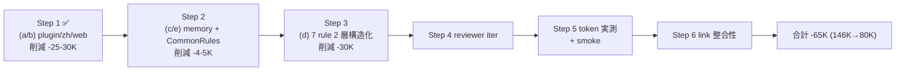

<!--
total_steps: 6
-->

# Task #51: Context Bloat Reduction (2 層構造化)

> Status: **🔄 進行中** (Step 1 ✅ / Step 2-6 🔲)
> 起案: 2026-05-28
> 承認: 2026-05-28 (user)
> 関連: harness 健全性 9 task umbrella の最終 2 task の 1 つ (task-51 / task-57)
> 設計起源: [context-bloat-reduction.md](../draft/context-bloat-reduction.md) ([harness-health-7items-analysis.md §10](../draft/harness-health-7items-analysis.md) 起点)

## Task ゴール

本 session 起動時の context tokens が **~146K → ~80K (44% 削減)** に減り、tool call parse 失敗が解消され、`.claude/rules/*.md` の規範 visibility は **Layer A (要約、context 注入) + Layer B (詳細、明示 Read のみ) の 2 層構造** で維持される。

## Task 依存先タスク

— (依存なし)

> 本 task は harness 健全性 umbrella の最終施策で、他 task の前提に位置しない。task-57 (confidence-gate G) は本 task 完了後の F (stale-harness) 適用 1-2 週間後に再評価予定 (保留中)。

## Task 作業概要

- (a/b) global plugin 棚卸し + user-level rule (zh / web) 整理 [user 手動、Step 1 完了済 2026-05-28]
- (c/e) memory SUPERSEDED 5+1 件削除 + CommonRules 旧 Critical Lessons section 削除
- (d) project rules 7 file の **2 層構造化** (Layer A 要約 + Layer B `.details.md` 退避 + Read trigger 4 条件)
- reviewer 5+ iter cycle (Read trigger 4 条件 test scenario 4 件含む)
- token 実測 + smoke regression + Layer B 非注入 smoke 7+ cases
- link reference 整合性 (Layer A ↔ Layer B back-link 両方向)

## Task 完了条件 (DoD)

- [ ] 起動時 context tokens: ~146K → ~80K (44% 削減、実測 before/after diff)
- [ ] Layer A 合計 ~20K tokens (実測)
- [ ] Layer B context 非注入実測 (system-reminder に `details.md` 0 件)
- [ ] 既存 smoke regression 0 (35 hook + ~100 case)
- [ ] 機械強制 hook (delegation-guard / autonomous-action-guard / workflow-guard / loop-confirmation-detector / task-rule-guard / draft-flow-guard / context-budget 等) 動作 PASS (各 1 case)
- [ ] AI 行動 regression なし (reviewer 5+ iter で CRITICAL+HIGH+MEDIUM = 0)
- [ ] Layer A→B link 全件存在 (grep `details.md`)
- [ ] Layer B→A back-link 全件存在
- [ ] Read trigger 4 条件 AI 判断 PASS (test scenario 4 件)
- [ ] 新規 smoke `layer-b-context-isolation-smoke.sh` 7+ cases PASS
- [ ] memory MEMORY.md index 一貫性 (削除 6 件分の link 0)
- [ ] `install.sh` rule 同期 path に `*.details.md` 追加
- [ ] 4 リポへ `bash install.sh --update <target>` 配布 (user manual)
- [ ] commit 完了 (push は feature branch 自律可、main merge は user 承認必須)

## Task 概要欄 (list.md 用、3 要素規範)

> 本 session で context tokens 肥大 (~146K / 11 Layer) による tool call parse 失敗を解消するため、global plugin 棚卸し + memory SUPERSEDED 削除 + project rules 7 file を **Layer A 要約 + Layer B 詳細 (paths:[] で context 非注入) の 2 層構造化** + Read trigger 4 条件明文化で進行する。完成すれば AI が通常運用では Layer A のみで判断し、違反検出 / 規範変更 / 新規事案 / 学習の 4 trigger で Layer B を明示 Read することで、規範 visibility を維持しつつ起動時 ~80K (44% 削減) を達成できる。

## 背景・目的

35th save-state (2026-05-28) で「context 肥大、tool call parse 失敗頻発」と報告。本 session 復元後の網羅調査で起動時 ~146K tokens / 11 Layer 構成を実測 (詳細は draft §1 真因サマリ参照):

| Layer | 内容 | サイズ |
|---|---|---:|
| 4 | project rules (常時参照 4 + paths-scoped 3) | ~50K |
| 8 | skills list (400+) | ~25K |
| 6 | memory (MEMORY.md + 22 feedback、SUPERSEDED 7) | ~18K |
| 5 | user-level rules (common + web + zh + README) | ~16K |
| 3 | CLAUDE.md + CommonRules | ~9K |
| 10 | Vercel Plugin | ~5K |
| 他 7 layer | system / hook / tool / MCP / runtime 等 | ~23K |

真因: rule / skill / memory / plugin が冗長・重複・本 repo 非依存で混入。paths-scoped rule の `paths: **` 指定が「常時参照」化、global plugin が repo 適合性判定なし。

## 仕様（要決定 → 決定済）

### Q1: 規範圧縮の手段

| 案 | 内容 | 評価 |
|---|---|---|
| A | 規範要約化のみ (subsection 削除) | 削減 -30K 止まり、規範 visibility 喪失リスク |
| B | 全 paths-scoped rule 削除 (機械強制 hook のみ) | 最大削減 -60K だが AI 行動劣化リスク高 |
| **C ハイブリッド** | global plugin 棚卸し + zh/web 整理 + memory SUPERSEDED + project rules **2 層構造化** (Layer A/B) + CommonRules 旧 lessons 削除 | -65K 達成 + 規範 visibility 維持 (Read trigger 4 条件で必要時参照) |

→ **C ハイブリッド採用** (user 2026-05-28 承認)。draft §2 参照。

### Q2: 規範文書の 2 層構造設計 (user 指摘 2026-05-28 で確定)

| 層 | 役割 | 物理配置 | context 注入 |
|---|---|---|---|
| **Layer A** | 要約版 (条文 / table / link reference) | `.claude/rules/<rule>.md` | claudeMd 経由で注入 (現状維持) |
| **Layer B** | 詳細版 (OK/NG 例 / history / 起源 / bypass 詳細 / 5 層強制詳細) | `.claude/rules/<rule>.details.md` | **frontmatter `paths: []` で非注入** |

**Layer B Read trigger 4 条件** (Layer A 冒頭に明記):
1. 違反検出時 (hook BLOCK / warn 注入受領)
2. 規範変更時 (rule 編集 / draft 起案 / 採用 N 条改定)
3. 新規事案 (初遭遇 keyword / 例外パターン疑い)
4. 学習 / dogfood (依存先必読 / harness audit / 副産物整理)

通常運用は Layer A のみで判断、Layer B Read skip (token 節約)。

## 設計

詳細設計は draft §3 採用案を SSoT とする。本 task ファイルは Step 計画 + 実装中の進捗 log を担う。



## TDD 戦略

### RED (先に追加するテスト)

- `.claude/tests/layer-b-context-isolation-smoke.sh` (新規、7+ cases)
  - Case 1: 各 `<rule>.details.md` の frontmatter `paths:` が空配列であることを検証
  - Case 2: 次 session 起動時の system-reminder claudeMd 展開に `details.md` が含まれない (silent regression check)
  - Case 3: Layer A 内に `> 詳細: [<rule>.details.md` link が各 file 1 件以上存在 (grep)
  - Case 4: Layer B 冒頭に `> Layer A: [<rule>.md` back-link 存在
  - Case 5: Read tool で `.details.md` を明示 path 指定すると取得可能 (mock test)
  - Case 6: Layer A 内重要 keyword (採用 6 条 / 遵守事項 2 例外 / plan-first / etc) 存在 (grep)
  - Case 7: `install.sh --update` の rule 同期対象 path pattern に `*.details.md` 含む (rsync include pattern grep)

### GREEN (最小実装)

- Step 2-3 で各 rule を Layer A (要約) + Layer B (`.details.md` 退避) に分割
- `install.sh` の `RULE_SYNC_PATTERN` 変数等に `*.details.md` 追加
- 新規 smoke を 7+ cases で実装

### REFACTOR

- Layer A 各 file で link reference 規約 3 形式統一 (詳細 / 例詳細 / 起源詳細)
- Layer B の anchor (`#遵守事項各条解説` 等) を navigation friendly に整理
- 既存 smoke の `paths-scoped rule` test を `Layer A` 命名に rename (visibility 改善)

## Step 計画

> 採用 6 条 (Task=Phase=N Step、2026-05-25): Phase 中間階層廃止、6 Step (実作業 3 + テスト設計レビュー + テスト合格 + リファクタリング)

### Step 計画前の事前確認 (実施済)

- `git log --all --grep context-bloat --oneline` → 関連 commit 0 (本 task が初回)
- `git log --all --grep paths-scoped --oneline` → task-22 / task-21 W1.7 で paths-scoped 既設、本 task の `paths:[]` 拡張は新規
- `ls .claude/rules/*.details.md` → 0 件 (本 task で新規作成)
- `grep -l 'details.md' .claude/rules/` → 既存 link 0、本 task で新規追加

### cross-repo write を含む Step の注意

Step 6 完了後の **4 リポへ `bash install.sh --update <target>` 配布** は **user manual (terminal) 実行のみ** (Claude Code sandbox + `delegation-guard.sh` 二重制約で agent 経路 denied)。本 task DoD の最終項目に該当。

### Step 一覧 (サマリ表)

| Step | Status | 作業概要 | 工数 | 依存 |
|:---:|:---:|:---|---:|:---|
| 1 | ✅ | (a/b) global plugin 棚卸し + user-level rule (zh / web) 整理 [user 手動] | 0.5h | — |
| 2 | ✅ | (c/e) memory SUPERSEDED 5 件削除 (v8 既存削除済の死リンク含 MEMORY.md 6 行整理) + CommonRules 旧 Critical Lessons section 圧縮 [完了 2026-05-28、削減 ~6K tokens] | 1.5h | Step 1 |
| 3 | ✅ | (d) project rules **6 file 2 層構造化完了** (git-workflow は退避不要)。**self-improvement** (pilot、~1.3K) / **development-process** (~1.3K) / **task-management** (~4.6K) / **workflow** (~2.1K) / **why-x5-output** (~0.3K) / **modes** (~0.3K) — 6 subagent 並列 + sequential で完遂、累計純削減 ~9.9K tokens、SSoT 劣化なし、Read trigger 4 条件 admonition 全 6 file 配置 | 8-11h | Step 2 |
| 4 | 🔲 | (テスト設計レビュー) 5+ reviewer 動的選定 + Read trigger 4 条件 AI 判断 test scenario 4 件 | 1.5-2h | Step 3 |
| 5 | 🔲 | (テスト合格) 起動時 token 実測 + 既存 smoke regression 0 + 新規 `layer-b-context-isolation-smoke.sh` 7+ cases PASS | 1.5h | Step 4 |
| 6 | 🔲 | (リファクタリング) Layer A ↔ Layer B back-link 両方向確認、link reference 規約統一、anchor 整理 | 0.5-1h | Step 5 |

合計工数: **14-18h (2.0-2.5d)**

### Step 1: (a/b) global plugin 棚卸し + user-level rule 整理 ✅

**Step status**: ✅ 完了 (2026-05-28、user 手動実施)

**作業概要**: `~/.claude/settings.json` `enabledPlugins` から Vercel-plugin / vercel / SuperClaude (sc:*) / Figma 除外、`~/.claude/rules/zh/` `~/.claude/rules/web/` rename or 削除。

**完了条件**: user 報告「step1のプラグインweb zhの削除は実行済み」(2026-05-28、本 task session message)。削減効果 (期待 -25-30K) は **次 session 起動時に実測** (Step 5 で before/after diff 確認)。

**ステータスログ**:
- 2026-05-28: user manual 完了 (本 session 内、IDE で `~/.claude/settings.json` 開いて編集確認済 = system-reminder hint より)

### Step 2: (c/e) memory SUPERSEDED + CommonRules 旧 Critical Lessons 削除 ✅

**Step status**: ✅ 完了 (2026-05-28)

**作業概要 (完了済)**:
- **Step 2a (CommonRules.md 圧縮、main agent 直接 Edit)**: §「hook で完全 BLOCK 強制済の旧教訓」section (旧 5 bullet + 説明文 + 末尾参照、~1K tokens) を 1 行 reference に圧縮、commit `516f2f6`、削減 -1K tokens
- **Step 2b (memory 削除、subagent 委譲、cross-path 制約回避)**: subagent a106d06ab27d294f7 (confidence 0.92) で memory 6 件処理 (5 件 rm + v8 1 件は既存削除済の死リンクとして MEMORY.md index 行のみ整理)、MEMORY.md index 6 行削除 + Why × N v10 entry に「v1-v9 経緯は why-x5-output.md §経緯 table 集約」追記、削減 ~5-6K tokens (目標 -4K 超過達成)

**完了条件 (達成)**:
- ✅ `ls ~/.claude/projects/-Users-t-hirai-work-hirai-method/memory/feedback_why_x5_v[7-9]*.md` → 0 件 (subagent 検証済、`No such file or directory`)
- ✅ `grep -q 'hook で完全 BLOCK 強制済の旧教訓' .claude/CommonRules.md` → exit 1 (圧縮で文言消失)
- ✅ MEMORY.md index 6 行削除 (24 → 18 行)
- ✅ 既存 smoke regression: skip 判定 (memory + 規範文書は smoke 独立、影響域なし、subagent 判定)

**実測削減**: ~6K tokens (Step 2a 1K + Step 2b 5K)

### Step 3: (d) project rules 7 file 2 層構造化 ✅

**Step status**: ✅ 完了 (2026-05-28)

**実完了 file**: 6 file (git-workflow.md は ~1K で退避不要として skip)

| file | subagent | Layer A bytes | Layer B bytes | 純削減 tokens | confidence |
|---|---|---:|---:|---:|:---:|
| self-improvement.md (pilot) | af4001777fb0a4586 | 4477 | 5367 | ~1.3K | 0.92 |
| development-process.md | adb60e5fa6b97a234 | 17423 | 17850 | ~1.3K | 0.85 |
| task-management.md | abfa1ab710acdbe25 | 14388 | 17386 | ~4.6K | 0.95 |
| workflow.md | ab7191b08060b054a | 22541 | 17479 | ~2.1K | 0.9 |
| why-x5-output.md | ab9682463ba3def5e | 4020 | 6725 | ~0.3K | 0.95 |
| modes.md | ad5a0ef67edd1c087 | 13347 | 17107 | ~0.3K | 0.85 |
| **合計** | — | **76196** | **81914** | **~9.9K** | median 0.91 |

**format 100% 踏襲確認**:
- Layer A frontmatter 維持 (paths-scoped 維持 / 常時参照は frontmatter なし)
- Read trigger 4 条件 admonition: 全 6 file 配置済
- Layer A→B link: 各 file 2 件以上
- Layer B→A back-link: 各 file 1 件
- Layer B frontmatter `paths: []`: 全 6 file 確認済
- link reference 規約 3 形式 (詳細 / 例詳細 / 起源詳細) 使用

**SSoT 劣化なし**: 各 file の条文 / table / 採用 N 条 / 遵守事項 N / 規約 keep。退避は OK/NG 例詳細 / history / 起源 / bypass 詳細 / 関連 artifact 完全 list のみ。

**作業概要**: 7 rule file を Layer A (`<rule>.md` 要約) + Layer B (`<rule>.details.md` 詳細、frontmatter `paths: []`) に分割。各 Layer A 冒頭に Read trigger 4 条件 table 追加、subsection 末尾に Layer B link 追加。

**スコープ**:

| 優先 | rule file | 現サイズ | Layer A 目標 | Layer B 退避 |
|:---:|---|---:|---:|---|
| 1 | `development-process.md` (paths-scoped) | ~15K | ~5K | `.details.md` ~10K |
| 2 | `task-management.md` (常時参照) | ~10K | ~4K | `.details.md` ~6K |
| 3 | `workflow.md` (paths-scoped) | ~10K | ~4K | `.details.md` ~6K |
| 4 | `modes.md` (常時参照) | ~8K | ~3K | `.details.md` ~5K |
| 5 | `self-improvement.md` (paths-scoped) | ~3K | ~1.5K | `.details.md` ~1.5K |
| 6 | `why-x5-output.md` (常時参照) | ~3K | ~1K | `.details.md` ~2K |
| 7 | `git-workflow.md` (常時参照) | ~1K | ~1K | (退避不要) |

**Layer A 必須要素**: 採用 N 条 / 遵守事項 / table (条文 keep) / bypass env 1-2 行 table / 重要 keyword 見出し / Layer B link / hook 名 / 起源 1 行
**Layer B 退避要素**: OK/NG 例詳細 / history / SUPERSEDED / bypass 詳細仕様 / 起源詳細 (commit hash, Post-Mortem) / 5 層強制詳細 / 関連 artifact 全件

**link reference 規約 (3 形式統一)**:
```markdown
> **詳細**: [<rule>.details.md §<section>](./<rule>.details.md#<anchor>)
> **例詳細**: [<rule>.details.md §例](./<rule>.details.md#例)
> **起源詳細**: [<rule>.details.md §起源](./<rule>.details.md#起源)
```

**完了条件**:
- 7 Layer A の合計 size 実測 ~20K (`wc -c .claude/rules/{development-process,task-management,workflow,modes,self-improvement,why-x5-output,git-workflow}.md` 合計)
- 7 (or 6) Layer B 物理存在
- 各 Layer A 内に Layer B link 1 件以上 (grep `details.md` 各 file 1+ hit)
- 各 Layer B 冒頭に back-link (`> Layer A: [<rule>.md`)
- 既存 smoke regression 0

### Step 4: (テスト設計レビュー)

**Step status**: 🔲

**作業概要**: 5+ reviewer 動的選定 (常時 base: tdd-guide / test-automator / qa-expert / pr-test-analyzer、domain-specific: harness-optimizer + architect-reviewer + technical-writer)。並列起動 (run_in_background: true)、収束まで反復 (上限 5 回、bypass `ECC_TEST_DESIGN_REVIEW_OFF=1`)。

**Read trigger 4 条件 AI 判断 test scenario 4 件**:
1. hook BLOCK 受領 → 該当 rule file の Layer B Read 経路に到達するか
2. `.claude/rules/<rule>.md` 編集要請 → Layer A + Layer B 両方 Read するか
3. 初遭遇 keyword (例: "retroactive draft") → grep Layer A → 不在なら Layer B Read するか
4. 依存先必読 task 着手 → 依存先 task ファイル + 関連 Layer B Read するか

**完了条件**: 全 reviewer approve / no objection (CRITICAL+HIGH+MEDIUM = 0)、iter cycle 5 回以内収束、Read trigger 4 条件 test scenario 全 PASS。

### Step 5: (テスト合格)

**Step status**: 🔲

**作業概要**:
- 起動時 token 実測 (`session start` 直後の context tokens を `context-budget.sh` 出力経由で計測、before/after diff)
- 既存 smoke 全 PASS (35 hook + ~100 smoke case、regression 0)
- 新規 `layer-b-context-isolation-smoke.sh` 7+ cases PASS
- 機械強制 hook 各 1 case PASS (delegation-guard / autonomous-action-guard / workflow-guard / loop-confirmation-detector / task-rule-guard / draft-flow-guard / context-budget)

**完了条件**:
- 起動時 tokens: before ~146K → after ~80K (44% 削減実測、誤差 ±5K 許容)
- 全 smoke `bash .claude/tests/<smoke>.sh` exit 0
- regression 0 (差分 file 列挙)

### Step 6: (リファクタリング)

**Step status**: 🔲

**作業概要**: Layer A ↔ Layer B back-link 両方向確認、link reference 規約 3 形式統一、anchor 整理 (navigation friendly)、`install.sh` の rule 同期 path pattern に `*.details.md` 追加。

**完了条件 (or skip)**:
- `grep -c '> \*\*詳細\*\*: \[.*\.details\.md' .claude/rules/*.md` → 各 file 1+ 件
- `grep -c '> Layer A: \[.*\.md' .claude/rules/*.details.md` → 各 file 1+ 件
- `grep -q 'details.md' install.sh` → exit 0 (rule 同期 path に Layer B 含む)
- 3 観点判定: 持続可能性 ✅改善 / 汎用性 ✅維持 / 非冗長化 ✅改善 (Layer A 圧縮で重複削減)

## 工数見積

**合計: 2.0-2.5d (14-18h、Step 1 完了済で残 13.5-17.5h)**

| Step | 実 / 残 | 工数 |
|:---:|:---:|---:|
| 1 ✅ | 実 | 0.5h |
| 2 | 残 | 1.5h |
| 3 | 残 | 8-11h |
| 4 | 残 | 1.5-2h |
| 5 | 残 | 1.5h |
| 6 | 残 | 0.5-1h |

## 影響範囲

| 範囲 | 詳細 |
|---|---|
| ファイル | `.claude/rules/*.md` (7 件、Layer A 化) / `.claude/rules/*.details.md` (6 件、Layer B 新規) / `~/.claude/projects/.../memory/feedback_*.md` (6 件削除) / `.claude/CommonRules.md` (1 section 削除) / `install.sh` (rule 同期 path 追加) / `.claude/tests/layer-b-context-isolation-smoke.sh` (新規) / `docs/tasks/list.md` (本 task 行更新) |
| migration | なし (frontmatter `paths:[]` は新規 field、claudeMd parser が空配列を扱う実装は既存) |
| 環境変数 | (option) `HC_LAYER_B_DETAIL_ENABLED` feature toggle で Layer B 構造の global on/off (default true) |
| 互換性 | Layer A は規範 SSoT として既存 link 維持、Layer B は新規 path で破壊的変更なし。`install.sh --update` で 4 リポ同期 |

## 再発防止

本 task 完了後、以下の派生 rule / skill / 監査項目を検討:

- (規範) `.claude/rules/*.md` に新規規範追加時は Layer A + Layer B 両方 update (Layer A: 1-2 段落要約 + link、Layer B: 詳細)。`draft-flow-guard.sh` 拡張で警告注入検討 (副産物 entry)
- (監査) `/harness-audit` に Layer A/B サイズ集計 + Read trigger 適合度 metric 追加 (副産物 entry)
- (skill) "Read trigger 判断" を skill 化 (例: `layer-b-read-trigger`) して AI 行動の SSoT 化 (副産物 entry)

## ステータスログ

| 日付 | 状態 | 備考 |
|---|---|---|
| 2026-05-28 | 起案 | draft `context-bloat-reduction.md` 起こし |
| 2026-05-28 | (draft follow-up) | user 指摘「Rule の要約 + 必要応じて詳細参照」反映、§3 Step 3 を 2 層構造化に書き換え (mdv update 済) |
| 2026-05-28 | 承認 | user 承認、本 task ファイル詳細化 + list.md update |
| 2026-05-28 | Step 1 完了 | (user 手動) global plugin (Vercel/sc/Figma) 除外 + `~/.claude/rules/zh/` `web/` 整理 |
| 2026-05-28 | Step 2 完了 | Step 2a: CommonRules.md 圧縮 commit `516f2f6` (-1K) + Step 2b: memory 5 件 rm + MEMORY.md index 6 行整理 subagent a106d06ab27d294f7 conf 0.92 (-5K)、累計削減 -6K tokens |
| 2026-05-28 | Step 3 pilot 完了 | self-improvement.md 2 層分割 (Layer A 4477B + Layer B 5367B、純削減 ~1.3K tokens)、subagent af4001777fb0a4586 conf 0.92、format 確立 (Layer A/B 構造 + link reference 規約 3 形式 + Read trigger admonition 配置) |
| 2026-05-28 | PR #25 merged | `f2becac` で main に統合済 (4 commit: 10b0e33 / 516f2f6 / 311b73c / 83ae19f、user merge 2026-05-28) |
| 2026-05-28 | Step 3 development-process.md 完了 | Layer A 17423B + Layer B 17850B、純削減 ~1.3K tokens、subagent adb60e5fa6b97a234 conf 0.85、pilot format 100% 踏襲、SSoT 内容劣化禁止制約で size 目標 ~5K 未達だが SSoT 無損失達成 |
| 2026-05-28 | Step 3 残 4 file 並列完了 | task-management (abfa1ab710acdbe25 conf 0.95、~4.6K) / workflow (ab7191b08060b054a conf 0.9、~2.1K) / why-x5-output (ab9682463ba3def5e conf 0.95、~0.3K) / modes (ad5a0ef67edd1c087 conf 0.85、~0.3K) を 4 並列 subagent で background 実行、Step 3 累計純削減 ~9.9K tokens、SSoT 劣化なし、format 100% 踏襲、git-workflow.md は ~1K で退避不要として skip |
| YYYY-MM-DD | Step 4 完了 | (テスト設計レビュー) 5+ reviewer 動的選定 + iter cycle 収束 (次 session) |
| YYYY-MM-DD | Step 5 完了 | (テスト合格) 起動時 token 実測 + smoke regression 0 + Layer B 非注入 smoke 7+ (次 session) |
| YYYY-MM-DD | Step 6 完了 | (リファクタリング) Layer A↔B back-link 整合 + install.sh sync path (次 session) |
| YYYY-MM-DD | 完了 | DoD 全 PASS + 4 リポ user manual install + commit `<sha>` |
| YYYY-MM-DD | Step 4 完了 | reviewer iter `<N>` 回で収束 |
| YYYY-MM-DD | Step 5 完了 | 起動時 token before/after 実測値 |
| YYYY-MM-DD | Step 6 完了 | commit `<sha>` |
| YYYY-MM-DD | 完了 | 4 リポ user manual install 完了 + DoD 全 PASS |

## 派生 task / 次アクション候補

### 義務 (development-process.md §「副産物発生時の即時 draft 起こし義務」準拠)

(本 task 完了 = `/finish-task` 時点で本 section の全 entry 処理済が必須)

### 起案時点での副産物候補

- [ ] (🟡) `draft-flow-guard.sh` 拡張で Layer A 編集時 Layer B 同期警告注入 (再発防止 §)
- [ ] (🟡) `/harness-audit` に Layer A/B サイズ + Read trigger metric 追加 (再発防止 §)
- [ ] (🟢) "Read trigger 判断" を skill 化 (`layer-b-read-trigger`) — Step 6 完了後の dogfood 1-2 session 観察後に判断 (再発防止 §)
- [ ] (🟢) `.claudeignore` に `*.details.md` 追加可能性調査 (Claude Code 仕様確認、Step 3 内で検証)

### 関連

- [`next-actions.md`](next-actions.md) — registry
- [`.claude/rules/development-process.md`](../../.claude/rules/development-process.md) §「副産物発生時の即時 draft 起こし義務」

## 関連

- Draft: [context-bloat-reduction.md](../draft/context-bloat-reduction.md) ✅ user 承認済 2026-05-28
- 既存分析: [harness-health-7items-analysis.md §10](../draft/harness-health-7items-analysis.md)
- umbrella: [harness-health-improvements.md](../draft/harness-health-improvements.md) (健全性 9 task)
- 依存タスク: — (依存なし)
- 派生タスク: task-57 (confidence-gate G 再評価、F 適用 1-2 週間後)
- mdv 確認 URL: https://mdv.sandboxes.jp/docs/context-bloat-reduction-task-51
