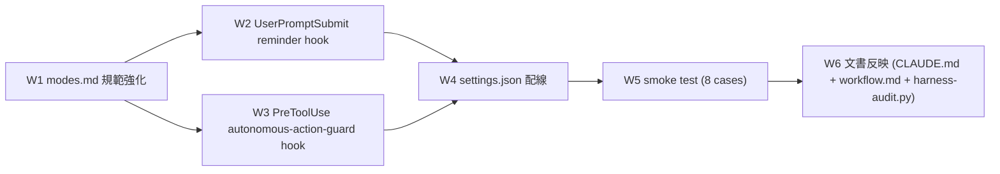

# Task #6: Loop モード自律進行強制 + 自律実行禁止リスト

> Status: **🔄 進行中** (W1 完了 @ commit `1bc9284` / W2-W6 残)
> 起案: 2026-05-12
> 関連: #1 (workflow-enforcement umbrella), #5 (副産物 discharge 機構)
> 設計起源: [`docs/draft/loop-auto-progress-enforcement.md`](../draft/loop-auto-progress-enforcement.md) (§8 で 2026-05-12 承認済)

## 背景・目的

Loop モード稼働中に **2 つの構造的事故** が頻発する状態を解消する。

**事故 A**: 並列 subagent 起動後にメインが「completion 待ち = ターン区切り報告」で停止し、独立作業を並行進行できない。user が「Loop モード継続中。なぜ自動で実行を続けないのか?」を **複数回** 指摘 (2026-05-12 セッション)。

**事故 B**: `git push` / `gh pr create` / production deploy / DB migration / secrets ローテーション等を「準備フェーズ」と区別せず Loop モードで自律実行可能な状態。撤回不可 / 第三者影響 / データ破壊リスクが構造的に残存。本セッション中に `git push` を **5 回以上** メインが自律実行した実観測あり。

→ 規範 (modes.md) + UserPromptSubmit hook + PreToolUse Bash hook + smoke test + 文書反映 で **5 層強制** する (副産物 discharge 機構と同パターン)。

## 仕様（要決定 → 決定済）

### Q1: 実装範囲

| 案 | 内容 | 評価 |
|---|---|---|
| A 最小実装 | modes.md 拡張のみ (hook なし) | 規範違反を機械検出できない |
| B フル強制 | rule + hook + settings.json permissions.deny 拡張 | 大規模変更、後戻り発生リスク |
| **C 段階導入** | Wave 1 (rule) / Wave 2 (UserPromptSubmit) / Wave 3 (PreToolUse) / Wave 4 (配線) / Wave 5 (smoke) / Wave 6 (文書) | **採用** — Wave 独立 deliver 可、検証分散、前例 (副産物 discharge) あり |

### Q2: permissions.deny 拡張 vs hook BLOCK 単独

| 案 | 内容 | 評価 |
|---|---|---|
| A hook 単独 | autonomous-action-guard.sh の exit 2 のみで block | hook 失敗時の defense-in-depth が無い |
| **B hook + permissions.deny の二重防御** | hook + settings.json の permissions.deny 拡張 (Loop モード時のみ) | **採用** — 誤検出リスク評価後に W4 で判断、誤動作なら deny を解除 |

### Q3: bypass の粒度

→ `ECC_AUTONOMOUS_ACTION_OVERRIDE=1` セッション全体 OFF + bypass.log 記録 (副産物 discharge と同方針)。コマンド単位 bypass は実装複雑度上の利得が小さい。

## 設計

### Wave 構成 (draft §3 と整合)

### W2 詳細: `.claude/hooks/loop-auto-progress-reminder.sh`

UserPromptSubmit hook。動作:
1. Loop モード判定 (`lib/mode-loader.sh` の `load_mode()`)、Normal モードなら fail-open (exit 0)
2. Claude Code 内蔵 TaskList から `in_progress` な subagent タスクを集計 (transcript path resolution は `confidence-gate.sh` の agent_id 経由を参考)
3. in_progress subagent > 0 かつ 直前応答が「待ち中報告 / 完了通知待ち / 次セッションで対応」キーワード含有 → `<system-reminder>` で「Loop モード違反: 独立作業を継続せよ」を stderr 注入
4. fail-open (exit 0)、hook 失敗で session を block しない

### W3 詳細: `.claude/hooks/autonomous-action-guard.sh`

PreToolUse Bash hook。動作:
1. `tool_input.command` を読み、11 カテゴリ禁止リスト (regex 配列) と照合
2. match + Loop モード → `exit 2` BLOCK + stderr に違反内容 / user 承認手順 / bypass 手順
3. match + Normal モード → context 注入のみ (user 確認を促す)
4. bypass: `ECC_AUTONOMOUS_ACTION_OVERRIDE=1` で skip + `lib/bypass-logger.sh` 経由で bypass.log 記録

禁止 regex 例:
- `^git push( |$)` (main 例外なし、全 branch)
- `^gh pr (create|merge)( |$)`
- `^gh release ( |$)`
- `^git tag .* origin` (tag push)
- `^vercel.* --prod( |$)`
- `^supabase db (push|reset)( |$)`

### W4 詳細: `.claude/settings.json` 配線

- `hooks.UserPromptSubmit` に `loop-auto-progress-reminder.sh` を append (既存 mode-enforce / context-budget / why-x5-reminder の **後** に配置 — 既存 hook の reminder が出てから本 hook が判定する想定)
- `hooks.PreToolUse` の Bash matcher に `autonomous-action-guard.sh` を append (既存 delegation-guard / task-rule-guard / gateguard の **前** に配置 — 自律禁止は最優先 BLOCK)
- `permissions.deny` 拡張は **W4 完了時に誤検出評価後** に判断 (二重防御 vs 過剰制限のトレードオフ)

## TDD 戦略

### RED (先に追加するテスト)

- `.claude/tests/loop-auto-progress-smoke.sh`
  - Case 1: Loop mode + subagent in_progress + 「待ち中」キーワード → reminder 発火 (stderr に reminder 含有)
  - Case 2: Loop mode + subagent not running → no reminder
  - Case 3: Normal mode → no reminder (fail-open)
  - Case 4: Loop mode + `git push origin feat/x` → exit 2 + stderr に違反内容
  - Case 5: Loop mode + `gh pr create --base main --head feat/x` → exit 2
  - Case 6: Loop mode + `vercel --prod` → exit 2
  - Case 7: Loop mode + `ECC_AUTONOMOUS_ACTION_OVERRIDE=1` + `git push` → exit 0 + bypass.log 1 行追加
  - Case 8: Loop mode + `git status` (non-target) → exit 0 (素通し)
  - Case 9: Normal mode + `git push` → exit 0 + stderr に context 注入 (BLOCK しない)

### GREEN (最小実装)

- W2 hook `loop-auto-progress-reminder.sh` 新設
- W3 hook `autonomous-action-guard.sh` 新設
- W4 settings.json 配線 (matcher 追加)
- 既存 11 smoke tests (workflow-guard / next-actions-hooks / context-budget) 全 PASS 維持

### REFACTOR

- 11 カテゴリ regex を `lib/autonomous-action-patterns.sh` に外部化し、env override (`HC_AUTONOMOUS_ACTION_PATTERNS`) で禁止リストを上書き可能にする (後続セッションで判断)
- bypass.log 集計の autonomous-action-guard 行を `harness-audit.py` の既存 `bypass_log_summary()` に追加

## Wave 構成

| Wave | 内容 | 工数 | 依存 | 状態 |
|:---:|:---|---:|:---|:---:|
| W1 | `.claude/rules/modes.md` に遵守事項 7+8 追記 | 0.4h | — | ✅ commit `1bc9284` |
| W2 | `loop-auto-progress-reminder.sh` 新規 (UserPromptSubmit) | 0.6h | W1 | 🔲 |
| W3 | `autonomous-action-guard.sh` 新規 (PreToolUse Bash) | 0.7h | W1 | 🔲 |
| W4 | settings.json 配線 + permissions.deny 拡張判断 | 0.3h | W2, W3 | 🔲 |
| W5 | smoke test `loop-auto-progress-smoke.sh` (8 cases) | 0.5h | W2, W3 | 🔲 |
| W6 | CLAUDE.md / workflow.md / harness-audit.py 反映 | 0.3h | 全 Wave | 🔲 |

合計工数: 2.8h (W1 完了済、残 2.4h)

## 完了条件

- [x] Wave 1: `.claude/rules/modes.md` に遵守事項 7+8 を追加、既存 1-6 を保持 (commit `1bc9284`)
- [ ] Wave 2: `loop-auto-progress-reminder.sh` 実装 + Case 1-3 PASS
- [ ] Wave 3: `autonomous-action-guard.sh` 実装 + Case 4-9 PASS
- [ ] Wave 4: `settings.json` 配線後に既存 11 smoke tests 全 PASS 維持確認
- [ ] Wave 5: 統合 smoke test 全 8 case PASS
- [ ] Wave 6: CLAUDE.md / workflow.md / harness-audit.py 反映
- [ ] 次セッション SessionStart で「Loop モード自律進行強制 + 自律禁止リスト稼働中」が `<system-reminder>` で確認可能
- [ ] task #2 (PR 作成) 着手時に autonomous-action-guard が `git push` を BLOCK、user 明示承認 (`ECC_AUTONOMOUS_ACTION_OVERRIDE=1` 設定) で実行可能

## 工数見積

合計 2.8h (W1 完了済、残 W2-W6 ≈ 2.4h)。実装 90 分 + smoke test 30 分 + 文書反映 30 分。

## 影響範囲

| 範囲 | 詳細 |
|---|---|
| ファイル | `.claude/rules/modes.md` (W1 済) / `.claude/hooks/loop-auto-progress-reminder.sh` 新規 / `.claude/hooks/autonomous-action-guard.sh` 新規 / `.claude/settings.json` 拡張 / `.claude/tests/loop-auto-progress-smoke.sh` 新規 / `CLAUDE.md` / `.claude/rules/workflow.md` / `.claude/scripts/harness-audit.py` |
| migration | なし |
| 環境変数 | `ECC_AUTONOMOUS_ACTION_OVERRIDE=1` (新規、bypass 用) / `HC_AUTONOMOUS_ACTION_PATTERNS` (将来拡張、optional) |
| 互換性 | Normal モードでは context 注入のみで非破壊。Loop モードでは push/PR 等が user 承認必須に変化 (意図された UX 変更) |

## 再発防止

- bypass.log の `autonomous-action-guard` 行を `harness-audit.py` で集計、bypass 頻度高 = 設計改善シグナル
- modes.md 遵守事項 8 の 11 カテゴリは将来追加項目 (例: AWS CLI prod operation / k8s apply / terraform apply) を追加可能な構造
- W2 reminder の発火条件は keyword detection ベース → false positive 観測で keyword tuning

## ステータスログ

| 日付 | 状態 | 備考 |
|---|---|---|
| 2026-05-12 | 起案 | 設計 draft `docs/draft/loop-auto-progress-enforcement.md` 起こし (commit `ecff97d`) |
| 2026-05-12 | 承認 | user 明示承認 (draft §8) |
| 2026-05-12 | W1 完了 | modes.md 遵守事項 7+8 追加 (commit `1bc9284`) |
| 2026-05-12 | next-actions 登録 | entry #6 として登録 (commit `261136c`) |
| 2026-05-12 | task 化 | `/new-task 6 loop-auto-progress-enforcement` 起動、本ファイル生成 |

## 派生 task / 次アクション候補

このタスクの実装中・レビュー中・完了時に「これは別 task として管理すべき」と判断した副産物 (byproduct) を箇条書きで記入する。

### 義務 (development-process.md §「副産物発生時の即時 draft 起こし義務」準拠)

- 副産物発見の瞬間に **必ず本セクションに記入** (memory / 会話履歴に流すだけは禁止)
- task 完了 (`/finish-task`) 時、本セクションのすべての entry が以下のいずれかに処理済であること:
  - (a) `docs/draft/<slug>.md` に draft 起こし済 (緊急度 🔴 / 🟡)
  - (b) `docs/tasks/next-actions.md` に entry 追加済 (緊急度 🟢 + 後日判断)
  - (c) 無視 (理由を明記、commit message に記録)

### 記入欄

(現時点で空。W2-W6 実装中に発見した副産物を追記)

### 関連

- [`next-actions.md`](next-actions.md) — 本セクションと連動する registry
- [`.claude/rules/development-process.md`](../../.claude/rules/development-process.md) §「副産物発生時の即時 draft 起こし義務」

## 関連

- Draft: [`docs/draft/loop-auto-progress-enforcement.md`](../draft/loop-auto-progress-enforcement.md)
- 依存タスク: #1 (workflow-enforcement umbrella、本 task は同パターンを Loop モードに適用), #5 (副産物 discharge 機構、5 層強制の前例)
- 派生タスク: task #2 (PR 作成) が本 task 完了後に autonomous-action-guard 越しに進行
