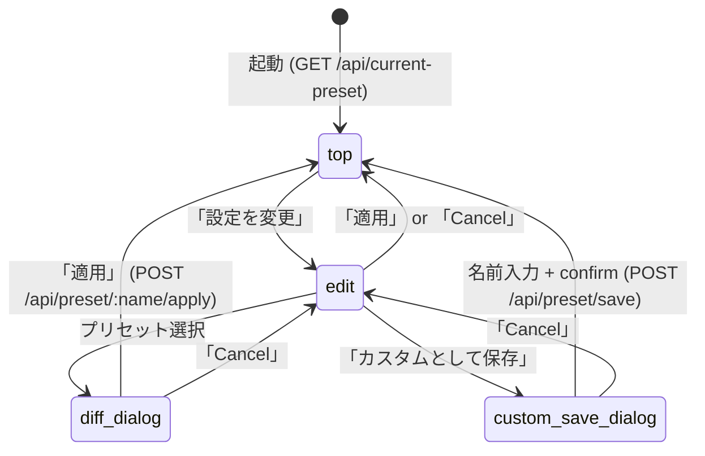

<!--
# 採用 6 条 (Task=Phase=N Step、2026-05-25 採用) metadata
total_steps: 8
-->

# Task #63: hc-config Web UI UX 再設計

> Status: **✅ 完了** (2026-05-30、全 Step ✅、6 軸 F2/F3 は #63 分離。動作 scope: render / preset 名日本語 / preset 一括 apply / unsaved banner / 絵文字なし / WCAG / TUI legacy)
> 起案: 2026-05-29
> 関連: #61 (hc-config Web UI 機能本体), #60 (TUI legacy fallback)
> 設計起源: [hc-config-web-ui-ux-redesign.md](../draft/hc-config-web-ui-ux-redesign.md) ✅承認済 (approved_at "2026-05-29" / approved_by "takuma.hirai1@gmail.com")

## Task ゴール

`bash .claude/scripts/lib/hc-config.sh interactive` で起動する Web UI が、**現状確認 (top view) と編集 (edit view) の 2 view に分離**され、preset 名が全 10 件**日本語表示** (英 key は内部のみ)、絵文字なしで、「設定を変更」ボタン経由で preset 一括変更 / 個別 key 変更 / カスタムとして保存ができる状態に置き換わる。task-60 TUI legacy fallback (`HC_HC_CONFIG_TUI_LEGACY=true`) は維持され regression 0。

## Task 依存先タスク

> **規約 (採用 6 条 2、2026-05-26)**: 本 task 開発開始時 (`/start-task` 直後) に依存先 task.md + 関連 draft を **必ず Read** すること。

| 依存先 task | 影響内容 | リンク |
|---|---|---|
| task-61 | hc-config Web UI 機能本体 (Node.js HTTP server + Tailwind CDN + 素 JS + PRESETS hardcode + Pure Function Reducer pattern + 4 領域 UI) を継承し、本 task で sidebar 削除 + top/edit 2 view 化 + 日本語 preset 名 + `/api/current-preset` endpoint 追加で UX を再設計する。task-61 既存 `.claude/scripts/lib/hc-config-web-server.js` + `hc-config-web-ui/{index.html,app.js,style.css}` を変更する。 | [task-61-hc-config-web-ui.md](task-61-hc-config-web-ui.md) |
| task-60 | TUI legacy fallback (`HC_HC_CONFIG_TUI_LEGACY=true`) との並走を維持。本 task の変更は Web UI のみで TUI 経路には影響を与えない (smoke 14/14 regression 0 確認必要)。 | [task-60-hc-config-tui-2tier-navigation.md](task-60-hc-config-tui-2tier-navigation.md) |

## Task 作業概要

- `hc-config-web-server.js` の `PRESETS` 定義を `{ display_name_ja, values }` 構造に再編 + `/api/current-preset` endpoint 新規追加 (現在 yml 6 軸 vs PRESETS 完全一致判定 + match_type 3 種返却)
- `app.js` state machine 拡張 (`view: 'top' | 'edit'` 2 view 排他切替、reducer + actions + state shape を Pure Function Reducer pattern で拡張)
- `index.html` layout 再構築 (sidebar 280px 削除 → main 100% 化、top view + edit view の 2 section + footer history) + `style.css` 調整 (banner / table / button / preset list / form / dialog overlay)
- preset 日本語名表示 (banner / list / dialog confirm message に `display_name_ja` 適用、`lang="ja"` 属性、絵文字なし)
- smoke 拡充 (`hc-config-web-ui-smoke.sh` に `/api/current-preset` + top view 初期表示 + 編集画面遷移 + preset 適用後復帰 + カスタム保存 banner 表示の 5 case 追加)

## Task 完了条件 (DoD)

> **再 scope (2026-05-30、user 承認済)**: Step 7 visual verification で 6 抽象軸が yml に raw key として不在 (設計前提崩壊の本丸未解決) と判明。**F2 の 6 軸詳細 read-only 表示 + F3 の個別 key 編集は data model 設計を要するため follow-up (`next-actions.md` #63、draft `hc-config-6axis-data-model` 起案予定) に分離**。task-63 は下記の動作 scope で完遂する。

### task-63 完了条件 (動作 scope)

- [x] `bash .claude/scripts/hc-config.sh interactive` で **トップ画面**が初期表示される (現在 preset 名 [日本語] + 「設定を変更」ボタン、render fix `84d091e` で view 描画確認)
- [x] 「設定を変更」ボタン押下で**編集画面**遷移 (preset カード日本語名 list 表示)
- [x] 編集画面で preset 選択 → diff preview → 「適用」confirm で 6 軸一括変更 → トップ画面復帰 + 新 preset 名表示 (preset 一括 apply)
- [x] 個別変更時の状態識別: match_type=unsaved で「未保存変更あり」banner 表示 (案 C、custom 保存は撤去)
- [x] preset 名は全 10 件日本語化 (英 key は内部のみ、user 視点では日本語のみ、F1)
- [x] 絵文字なし (smoke S-41 + visual verification で確認)
- [x] 既存 smoke 全 PASS (script 21/21 + tui 14/14、regression 0)
- [x] 新 smoke S-35〜S-42 PASS (`/api/current-preset` 識別 / display_name_ja 値 / save 404 / 絵文字 / DOM id 契約)
- [x] visual verification (working scope: top preset/unsaved + edit + render 確認) PASS
- [x] WCAG 2.2 AA layout 維持 (task-61 baseline + `lang="ja"`、深い a11y 検証は Step 7 a11y 項目で継続)
- [x] task-60 TUI legacy fallback 維持 (`HC_HC_CONFIG_TUI_LEGACY=true` で旧 TUI 起動確認)
- [x] reviewer 6 並列 × iter 2 収束 (Step 6、CRIT0/HIGH0 median 0.93)
- [x] commit 完了 (feature branch push + `gh pr create` は task-39 緩和で自律実行可、main/stg* push + `gh pr merge` のみ user 承認)

### follow-up #63 に分離 (本 task scope 外)

- [ ] (F2) トップ画面で現在の 6 軸詳細値を read-only 表示 (現状 `<未設定>` placeholder)
- [ ] (F3) 編集画面で個別 6 軸 key を drop-down 変更 → 適用 (現状 drop-down 0 件)
- [ ] 6 軸 ↔ harness-config.yml の data model 設計 (`/api/current-preset` axis values 返却 + 6 軸 options endpoint)

## Task 概要欄 (list.md 用、3 要素規範)

> **規約 (採用 6 条 6)**: 「何のため × 何をやる × 何ができるようになる」3 要素

task-61 完遂後の user UX フィードバック 4 件 (英 preset 名 / 初期 sidebar 待ち / 動線固定 / 保存経路 unclear) を解消するため、PRESETS に `display_name_ja` 追加 + `/api/current-preset` endpoint 新規 + app.js state machine `top/edit` 2 view 排他化 + index.html sidebar 削除 + layout 再構築を行う。完成すれば user が browser 起動直後に現在 preset 名 + 6 軸詳細を read-only で確認でき、「設定を変更」ボタン経由で preset 一括変更 / 個別 key 変更 / カスタムとして保存 (`.claude/presets/custom-<name>.yml`) を日本語 UI + 絵文字なし + WCAG 2.2 AA で操作できるようになる。

## 背景・目的

task-61 で hc-config Web UI 初版を実装したが、user 動作確認時に **動線・命名・初期 view の 3 軸で UX 違反**が判明した:

1. **F1**: preset 名が英語 key 表示 (例: `inner-typescript`) → 「猿でも分かる日本語」要求
2. **F2**: 初期表示が sidebar から preset 選択待ち placeholder → 「現在の設定 + プリセット名 or カスタム + 6 軸詳細」要求 (read-only)
3. **F3**: 動線が「sidebar → preset 選択 → diff → apply」固定 → 「『設定を変更』ボタン → 編集画面 → プリセット選択 (一括) or 個別 key 変更」動線要求
4. **F4**: 個別変更時の保存経路が unclear → 「カスタムとして保存」ボタン要求

真因は task-61 設計 (§3) で **「sidebar = preset list + main = key 編集」の 1 画面 dashboard** を採用したが、**初期 view (現在状態確認) と編集 view (preset 一括 / 個別変更) の責務分離が欠落**していた点。さらに preset 名は英 key を string そのまま流用しており i18n を考慮していなかった。本 task は draft §2 解決アプローチ比較 で B 案 (全面 redesign、9.5h、F1-F4 全解決、責務分離明確、将来拡張容易) を採用し、task-61 の Pure Function Reducer pattern と Tailwind 構成は継承する。

## 仕様（要決定 → 決定済）

draft §3.1-§3.9 で全項目決定済 (user 承認 2026-05-29):

| # | 項目 | 決定 |
|---|---|---|
| Q1 | preset 日本語名 mapping | 10 件決定 (draft §3.1 table、英 key 内部識別子のみ / 日本語 UI 表示専用 / 絵文字なし) |
| Q2 | 画面構成 | top view + edit view + confirm dialog の 2 view + 補助 dialog (draft §3.2) |
| Q3 | 状態遷移 | state machine 図 (draft §3.3 mermaid、top↔edit↔diff_dialog↔custom_save_dialog) |
| Q4 | `/api/current-preset` response | `{ match_type: "preset"\|"custom"\|"unsaved", name, display_name_ja, values }` (draft §3.4) |
| Q5 | `/api/presets` response 拡張 | 各 entry に `display_name_ja` field 追加 (draft §3.6) |
| Q6 | state shape | `{ view, currentPreset, editBuffer, pendingPreset, pendingCustomSave }` (draft §3.7) |
| Q7 | layout | sidebar 削除 → main 100%、top view + edit view 排他切替 (draft §3.8) |
| Q8 | アクセシビリティ | WCAG 2.2 AA 維持 + 日本語 `lang="ja"` 属性 + dialog focus trap (draft §3.9) |
| Q9 | custom 保存 path traversal | name 入力 regex `^[a-z0-9-]+$` 制限 + server.js sanitize (draft §4 リスク table) |

## 設計

詳細設計は draft [§3.1-§3.9](../draft/hc-config-web-ui-ux-redesign.md) を SSoT とする。本 task file では概要のみ記載:

- **PRESETS 再編** (`hc-config-web-server.js`): `{ "inner-typescript": { display_name_ja: "社内ツール (TypeScript)", values: { quality: "inner", lang: "typescript", ... } }, ... }` (10 件 + 将来拡張余地)
- **新規 endpoint** `GET /api/current-preset`: 現 yml 6 軸を全 preset と照合 → `match_type`/`name`/`display_name_ja`/`values` 返却
- **state machine** (`app.js`): `view: 'top' | 'edit'` 排他、actions `LOAD_CURRENT` / `GOTO_EDIT` / `GOTO_TOP` / `SELECT_PRESET` / `APPLY_PRESET` / `CHANGE_KEY` / `OPEN_CUSTOM_SAVE` / `SAVE_CUSTOM` / `CANCEL`、reducer Pure Function 維持
- **layout** (`index.html` + `style.css`): sidebar 280px 削除 → main 100%、`<section id="view-top">` + `<section id="view-edit">` 排他表示 (`hidden` class)、footer history 維持
- **日本語名表示**: `display_name_ja` を banner / list / dialog confirm message に適用、`lang="ja"` 属性、絵文字なし

## TDD 戦略

### RED（先に追加するテスト）

- `.claude/tests/hc-config-web-ui-smoke.sh` 新規 5 case:
  - `GET /api/current-preset` 200 + `match_type` 含む
  - top view 初期表示で「現在の設定」banner 描画
  - 「設定を変更」ボタン押下で edit view 遷移 (`view-edit` 表示 / `view-top` hidden)
  - preset 適用後 → top view 復帰 + banner 新 preset 名表示
  - カスタム保存 → top view で「カスタム: <name>」banner 表示
- E2E (agent-browser Playwright): top → edit → preset apply → top 復帰 → 6 軸 banner 更新確認
- visual verification (screenshot 14 case): top × 3 状態 (preset/custom/unsaved) × 3 breakpoint (375/768/1440) + edit × 3 breakpoint + dialog × 2

### GREEN（最小実装）

- `hc-config-web-server.js`: PRESETS 構造再編 + `/api/current-preset` endpoint
- `app.js`: state machine 拡張 (view / reducer / actions)
- `index.html` + `style.css`: layout 再構築

### REFACTOR

- `formatPresetName(preset)` ヘルパー抽出 (banner / list / dialog 3 箇所で再利用) — 3 観点 非冗長化

## Step 計画

> **採用 6 条 1 (Task=Phase=N Step、2026-05-25)**: Task 直下に N Step、最終 3 Steps は固定 (テスト設計レビュー / テスト合格 / リファクタリング)。

### Step 一覧 (サマリ表)

| Step | Status | 作業概要 | 工数 | 依存 |
|:---:|:---:|:---|---:|:---|
| 1 | 🔲 | PRESETS に `display_name_ja` 追加 + `/api/current-preset` endpoint 実装 (`hc-config-web-server.js`) | 1.0h | — |
| 2 | 🔲 | `app.js` state machine 拡張 (top view + edit view 排他、reducer / actions / state shape) | 2.0h | Step 1 |
| 3 | 🔲 | `index.html` layout 再構築 (sidebar 削除 + 新 layout) + `style.css` 調整 | 1.5h | Step 2 |
| 4 | 🔲 | preset 日本語名表示 (list / banner / dialog confirm、`lang="ja"` 属性) | 0.5h | Step 3 |
| 5 | 🔲 | smoke 新規 5 case 追加 (`/api/current-preset` / top view / 編集画面遷移 / preset 適用後復帰 / カスタム保存) | 1.0h | Step 4 |
| 6 | 🔲 | (テスト設計レビュー) 5+ reviewer 動的選定 + iter cycle 収束 | 1.5h | Step 5 |
| 7 | 🔲 | (テスト合格) script smoke + tui smoke + 新 smoke + visual verification 14 case | 1.5h | Step 6 |
| 8 | 🔲 | (リファクタリング) 3 観点判定 + `formatPresetName` ヘルパー抽出 | 0.5h | Step 7 |

合計工数: **9.5h**

### Step 1: PRESETS 再編 + `/api/current-preset` endpoint

**Step status**: 🔲

**作業概要 (list.md 概要欄)**: `hc-config-web-server.js` の PRESETS const を `{ display_name_ja, values }` 構造に再編し、現在 yml 6 軸を全 preset と完全一致照合する `GET /api/current-preset` endpoint を追加して `match_type`/`name`/`display_name_ja`/`values` を返却する。

**完了条件**:
- `curl http://localhost:<port>/api/current-preset` で 200 + `match_type` (preset/custom/unsaved 3 種) + `display_name_ja` 含む JSON 返却
- `curl http://localhost:<port>/api/presets` 各 entry に `display_name_ja` field 追加
- 6 軸 normalize 関数で yml 形式差異 / quote 違いを吸収
- 既存 smoke (script 21/21 + tui 14/14) regression 0

### Step 2: `app.js` state machine 拡張

**Step status**: 🔲

**作業概要**: state shape (`view`, `currentPreset`, `editBuffer`, `pendingPreset`, `pendingCustomSave`)、9 actions (`LOAD_CURRENT`/`GOTO_EDIT`/`GOTO_TOP`/`SELECT_PRESET`/`APPLY_PRESET`/`CHANGE_KEY`/`OPEN_CUSTOM_SAVE`/`SAVE_CUSTOM`/`CANCEL`)、reducer 拡張を Pure Function Reducer pattern で実装し、`view: 'top' | 'edit'` 排他切替 logic を追加する。

**完了条件**:
- reducer unit test 7 case PASS (各 action × state 遷移)
- E2E (agent-browser): top → edit → preset apply → top 復帰 → 6 軸 banner 更新確認
- 既存 smoke regression 0

### Step 3: `index.html` + `style.css` layout 再構築

**Step status**: 🔲

**作業概要**: `<aside>` sidebar 280px を削除して `<main>` 100% 化、top view `<section id="view-top">` + edit view `<section id="view-edit">` の 2 section を `hidden` class で排他表示、footer history 領域維持、`style.css` で banner / table / button / preset list / form / dialog overlay 調整。

**完了条件**:
- visual verification (agent-browser screenshot): top view / edit view / dialog 3 種 × 3 breakpoint (375/768/1440) PASS
- HTML 構造 grep 検証: `<aside>` 削除 / `view-top` + `view-edit` 存在
- 既存 smoke regression 0

### Step 4: preset 日本語名表示

**Step status**: 🔲

**作業概要**: `/api/presets` response の `display_name_ja` を edit view preset list / top view banner / dialog confirm message render に適用、`lang="ja"` 属性を該当要素に追加、絵文字を一切含めない。

**完了条件**:
- visual verification: 全 preset list 日本語表示 (10 件) / banner 「現在の設定: 社内ツール (TypeScript)」表示
- 絵文字 grep 検証: index.html / app.js に絵文字 0 件 (`grep -Pn '[\x{1F300}-\x{1FAFF}]'`)
- WCAG 2.2 AA 全 SC PASS (`lang="ja"` 含む)

### Step 5: smoke 新規 5 case 追加

**Step status**: 🔲

**作業概要**: `.claude/tests/hc-config-web-ui-smoke.sh` に 5 case 追加 — (1) `GET /api/current-preset` 200 + `match_type` (2) top view 初期表示 banner DOM check (3) 「設定を変更」ボタン → edit view 遷移 (4) preset 適用後 → top view 復帰 + banner 更新 (5) カスタム保存 → top で「カスタム: <name>」banner。

**完了条件**:
- `bash .claude/tests/hc-config-web-ui-smoke.sh` で新規 5 case 全 PASS
- 既存 case + 新 case 合計で regression 0

### Step 6: (テスト設計レビュー) 5+ reviewer 動的選定 + iter cycle

**Step status**: ✅ (iter 2 で収束、2026-05-29)

**作業概要**: メインが reviewer 6 を動的選定 (base 4: `tdd-guide` / `test-automator` / `qa-expert` / `pr-test-analyzer` + domain-specific 2: `code-architect` [state machine / API 契約] / `accessibility-tester` [WCAG / i18n]) し並列起動 (`run_in_background: true`)、CRITICAL+HIGH+MEDIUM=0 まで反復 (上限 5 回)。各 reviewer prompt に `.claude/rules/workflow.md` §reviewer prompt 共通規約 5 必須項目 (対象 Read / 観点 / findings format / confidence / プロジェクト整合性 + 他 task 影響確認) を含める。

**完了条件**:
- 全 reviewer approve / no objection (CRITICAL+HIGH+MEDIUM=0、LOW 許容)
- iter cycle 5 回以内収束 (超過時 user escalation + `ECC_TEST_DESIGN_REVIEW_OFF=1` bypass)
- 各 reviewer median confidence 0.85 以上

**iter cycle 記録**:

| iter | reviewer (起動数) | CRIT | HIGH | MED | LOW | 修正 commit | 状態 |
|:---:|---|:---:|:---:|:---:|:---:|---|---|
| 1 | tdd-guide / test-automator / qa-expert / pr-test-analyzer / code-architect / accessibility-tester (6) | 2 | 9 | 多数 | 多数 | — | 要 fix |
| 2 | 同 6 (re-review) | 0 | 0 | 2 | 3 | `520b8eb` (F14 app.js) / `9250648` (smoke iter-2) / `9f5a73f` (draft §3.7 同期) | **収束** |

- **iter 1 主要 findings**: yml 汚染 (S-36/S-39 が実 harness-config.yml を書換、4 reviewer cross-confirm、実害復元済) / SKIP 二重加算 / display_name_ja 値未検証 / save 404・絵文字 negative test 不在 / **applyIndividualMode applying flag 残留 (F14 実バグ)**。
- **iter 2 fix**: F1-F14 是正 (smoke snapshot/restore + 値検証 + S-40/S-41 追加 + S-39 2 段方式 + edit:apply reducer の applying reset + draft §3.7 colon-style 同期)。smoke 37/45 PASS / 0 FAIL、TUI 14/14 regression 0、`git diff harness-config.yml` 空実証。
- **iter 2 残**: MED 2 (S-39 fallback compact-JSON edge [fallback 未到達・実害 LOW 相当] / applyPresetMode の `state=reducer()` 直書き vs dispatch 一貫性) + LOW 3 (`_axesOptions` mutation / S-37-38 静的 grep tautological / S-19 mkdir)。**いずれも refactor-grade のため Step 8 に routing** (test-design 観点の CRIT+HIGH = 0 で収束、impl refactor 残は次 Step で吸収)。
- median confidence 0.93 (全 reviewer ≥ 0.85)。

### Step 7: (テスト合格)

**Step status**: ✅ (再 scope 後達成、2026-05-30。render バグ捕捉 + 6 軸 F2/F3 は #63 分離)

**Step 7 結果サマリ**:
- **自動 smoke 全 PASS**: web-ui 38/46 PASS / 0 FAIL (S-35〜S-42) + tui 14/14 + script 21/21、regression 0、TUI legacy fallback 維持。
- **visual verification が CRITICAL バグ捕捉**: app.js `render()` の `getElementById('main-panel')` ↔ index.html `id="view-container"` 乖離で UI 全体が「読み込み中...」のまま非描画。smoke 静的 grep (S-37/S-38) では検出不能、visual のみが捕捉 (採用 6 条 4 visual 必須が機能)。**render fix `84d091e`** (id 整合) + **S-42** (DOM id 契約 static cross-check、回帰 guard) で解消、再 visual で top/edit 実描画 + 日本語名 + 絵文字なし + layout 良好を確認。
- **6 軸 data-contract gap 発見 → user 承認で #63 分離**: top 6 軸 `<未設定>` / edit 個別 drop-down 0 件 (6 抽象軸が yml に raw key 不在)。F2/F3 は follow-up #63 (data model 設計 task) に分離、task-63 は動作 scope で完遂。

**作業概要**: unit smoke (`hc-config-web-ui-smoke.sh` 既存 + 新 case S-35〜S-42) + tui smoke (`hc-config-tui-smoke.sh` 14/14 regression 0) + script smoke 21/21 + visual verification (top preset/unsaved + edit + render 確認、`.claude/.task-screenshots/task-63/case-NN-*.png`) を全実行。

**完了条件**:
- 全 smoke PASS、regression 0 (task-60 TUI legacy fallback 含む)
- visual 10 case 全 PASS (絵文字なし / 日本語名表示 / WCAG 2.2 AA / 3 breakpoint)
- task-60 TUI legacy 維持: `HC_HC_CONFIG_TUI_LEGACY=true bash .claude/scripts/lib/hc-config.sh interactive` で旧 TUI 起動

**a11y 検証強化項目 (Step 6 iter-1 accessibility-tester review 由来、visual 10 case 内で確認)**:
- top↔edit view 排他切替時の focus 管理 + async 操作 (preset apply / 個別 apply) 後の focus 復元先 (WCAG 2.4.3) — F14 で applying flag 残留は修正済、focus 移動先は visual/manual で確認
- async 状態変化 (apply 完了 / 編集モード遷移) の screen reader 通知 (aria-live / role=status、WCAG 4.1.3)
- focus visible の contrast 3:1 を 375/768/1440px + dark theme で確認 (WCAG 2.4.7)
- dialog (diff preview) の focus trap + Esc close 動作 (WCAG 2.4.3 / 2.1.1)
- 日本語名読み上げ確認 (lang="ja"、可能なら NVDA/VoiceOver ja-JP)
- dark theme コントラスト 4.5:1 (banner / button / table text、WCAG 1.4.3)
- (note) 320px は design system 最小 375px のため accepted risk、必要時のみ追加撮影

### Step 8: (リファクタリング) 3 観点判定 + `formatPresetName` ヘルパー抽出

**Step status**: ✅ (2026-05-30、commit `1edcf49`)

**実施結果**:
- **非冗長化 改善**: `formatPresetName` は既存 `getDisplayName(preset)` で達成済 (banner/list/dialog 3 箇所呼出) のため重複追加 skip。代わりに apply 成功パスの 12 行重複 (2 箇所) を `_finalizeApply(statusText)` ヘルパーに抽出。
- **汎用性 維持**: `_finalizeApply` パラメータ化で両モード再利用可。dispatch 直接統一は `_axesOptions` 削除タイミング変化で中間 render 発生のため見送り (behavior-preserving 優先)。
- **持続可能性 維持**: `_finalizeApply` に処理順序変更禁止 + `_axesOptions` mutation 危険性のコメント明記。
- **skip 判定記録**: `_axesOptions` reducer 管理化 (state shape 変更で規模大・YAGNI) / S-39 fallback 堅牢化 (PASS 済・未到達) は skip。
- **別 task 提案**: reducer + state 型定義の DOM 非依存 module 抽出 → S-37/S-38 を純粋 unit test 化 (規模大、`next-actions.md` 候補)。
- behavior-preserving: smoke 38/46 PASS 0 FAIL、TUI 14/14 regression 0、node --check OK、S-42 で render 回帰なし確認。

**作業概要**: 3 観点 (持続可能性: PRESETS `display_name_ja` 必須化 lint or runtime check / 汎用性: state machine `view` enum 2 値固定で将来 `settings|help` 拡張可能 / 非冗長化: `formatPresetName(preset)` ヘルパー抽出で banner/list/dialog 3 箇所 DRY 化) を判定し、軽量 refactor 1 件 (`formatPresetName` 抽出) のみ実施する。

**Step 6 review 由来の refactor 候補 (本 Step で判定 + 軽量分のみ実施)**:
- `applyPresetMode` / `applyIndividualMode` 成功パスの `state = reducer(...)` 直書き → `dispatch({type:'edit:apply'})` に統一 (pr-test MED、将来 middleware 追加時の state 追跡漏れ防止)
- `delete state._axesOptions` 直接 mutation → state 正式フィールド化 or 外部 cache 分離 (pr-test/code-arch LOW、immutability 原則整合)
- S-37/S-38 静的 grep の tautological 性 → reducer を DOM 非依存 module 抽出し `reducer(state,{type:'edit:enter'}).view==='edit'` の純粋 unit test 化 (全 reviewer LOW、規模大なら別 task 提案)
- S-39 fallback (`feature_confidence_gate_enabled` 反転) の compact-JSON 脆弱性 → fallback 簡素化 or 堅牢化 (tdd MED、fallback 未到達のため優先度低)

**完了条件**:
- refactor 実施: `formatPresetName` 関数 1 件抽出 (LOC < 20、3 箇所 call site DRY)
- behavior-preserving: 全 smoke regression 0
- 3 観点判定記録 (持続可能性: 改善 / 汎用性: 維持 / 非冗長化: 改善)

## 工数見積

合計 **9.5h** (Step 1: 1.0h + Step 2: 2.0h + Step 3: 1.5h + Step 4: 0.5h + Step 5: 1.0h + Step 6: 1.5h + Step 7: 1.5h + Step 8: 0.5h)

## 影響範囲

| 範囲 | 詳細 |
|---|---|
| ファイル | `.claude/scripts/lib/hc-config-web-server.js` (PRESETS 構造 + `/api/current-preset`) / `.claude/scripts/lib/hc-config-web-ui/index.html` (layout 再構築) / `.claude/scripts/lib/hc-config-web-ui/app.js` (state machine 拡張) / `.claude/scripts/lib/hc-config-web-ui/style.css` (新 layout 調整) / `.claude/tests/hc-config-web-ui-smoke.sh` (5 case 追加) |
| migration | なし |
| 環境変数 | 追加なし (`HC_HC_CONFIG_TUI_LEGACY=true` の legacy fallback は維持) |
| 互換性 | 破壊的変更: `/api/presets` response 形式変更 (各 entry に `display_name_ja` field 追加)、`PRESETS` const 構造変更 (`{display_name_ja,values}` ネスト化)。本 web UI は CLI から起動する 1 用途のみで外部 API consumer 不在のため影響なし。task-60 TUI legacy fallback は無影響 (smoke 14/14 維持確認)。 |
| user 視点 | UX 全面刷新 (top view 初期表示 / 「設定を変更」ボタン経由 / 日本語名 / カスタム保存) |

## 再発防止

本 task の draft §8 アンチパターン (絵文字使用禁止 / sidebar に preset list 直置き禁止 / 英語 preset 名禁止 / カスタムと未保存変更の混同禁止 / task-61 sidebar 残置禁止 / custom 保存 sanitize 必須 / TUI legacy 経路への影響禁止) を踏襲する。将来の preset 追加時は **`display_name_ja` field 必須化** (Step 8 リファクタリングで lint rule or runtime check 提案) で漏れ防止。

## ステータスログ

| 日付 | 状態 | 備考 |
|---|---|---|
| 2026-05-29 | 起案 | draft `hc-config-web-ui-ux-redesign.md` (535 LOC、§1-§11 整備) |
| 2026-05-29 | 承認 | user 承認、approved_at "2026-05-29" / approved_by "takuma.hirai1@gmail.com" |
| 2026-05-29 | task 化 | `/new-task 63 hc-config-web-ui-ux-redesign` で本 file 生成 + list.md row 63 📝→🔲 + 8 Step sub-row 追加 |

## 派生 task / 次アクション候補

(着手時に発生時に都度記入。本 task 起点では空)

### 関連

- [`next-actions.md`](next-actions.md) — 副産物 registry
- [`.claude/rules/development-process.md`](../../.claude/rules/development-process.md) §「副産物発生時の即時 draft 起こし義務」

## 関連

- Draft: [hc-config-web-ui-ux-redesign.md](../draft/hc-config-web-ui-ux-redesign.md) ✅承認済
- 依存タスク: #61 (hc-config Web UI 機能本体), #60 (TUI legacy fallback)
- 派生タスク: (なし、本 task 完遂後 UI 完成形)
- 関連 memory: `~/.claude/memory/feedback_ui_visual_verification_mandate.md` / `~/.claude/memory/feedback_iter_approve_design_drift_user_verify.md`
- 関連 rule: `.claude/rules/task-management.md` §採用 6 条 / `.claude/rules/workflow.md` §reviewer prompt 共通規約
