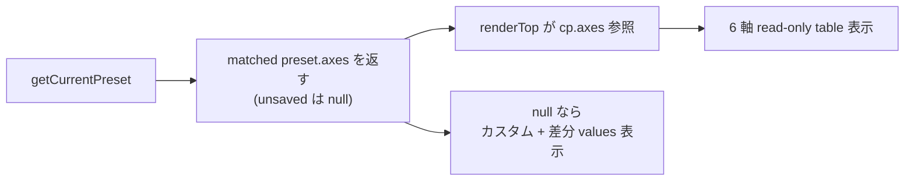

<!--
total_steps: 6
-->

# Task #65: hc-config Web UI 6 軸 data model (案A: preset metadata 方式)

> Status: **✅ 完遂** (2026-06-01、全 6 Step ✅、visual で 6 軸実値描画確認 = `<未設定>` 解消)
> 起案: 2026-06-01
> 関連: #63 (発生源、UX 再設計), #61 (Web UI 本体), #60 (TUI legacy)
> 設計起源: [hc-config-6axis-data-model.md](../draft/hc-config-6axis-data-model.md) ✅承認済 (approved_at 2026-06-01 / approved_by takuma.hirai1@gmail.com)

## Task ゴール

`bash .claude/scripts/lib/hc-config.sh interactive` の Web UI top view で、現在 preset 一致時に 6 軸 (quality_level / language_framework / git_workflow / tdd_policy / review_intensity / autonomy_level) が日本語ラベル + 値で read-only 表示され (`<未設定>` 解消)、unsaved 時はカスタム + 差分 values 表示に切替わる。`/api/current-preset` が matched preset の `axes` を返し、edit view の機能不全 6 軸 dropdown は撤去される。yml schema 変更なし。

## Task 依存先タスク

| 依存先 task | 影響内容 | リンク |
|---|---|---|
| task-63 | hc-config Web UI UX 再設計の成果物 (`/api/current-preset` 案 C 簡素化 + app.js top/edit 2 view + index.html layout) を継承。本 task は §3.6 で削除した `axes` 返却を additive に復活させ §3.4 wireframe の 6 軸 table を populate する。 | [task-63-hc-config-web-ui-ux-redesign.md](task-63-hc-config-web-ui-ux-redesign.md) |
| task-61 | Web UI 本体 (Node.js HTTP server + PRESETS + Pure Function Reducer pattern)。`PRESET_AXES` 定義 + 各 preset の `axes` メタデータは task-61 由来、本 task で API 返却に活用。 | [task-61-hc-config-web-ui.md](task-61-hc-config-web-ui.md) |

## Task 作業概要

- `hc-config-web-server.js` `getCurrentPreset` が matched preset の `axes` (6 key) を返す (A3 部分 revert、additive)、unsaved 時は `axes: null`
- `app.js` top view `renderTop` を API `axes` 参照に修正 + unsaved 時カスタム表示 + `loadCurrentAxes` fallback 撤去
- `app.js` edit view 6 軸 dropdown (機能不全 dead UI) 撤去、編集経路は preset 一括変更の **1 経路** (per-key 個別編集 UI は task-63 簡素化で元々不在 = phantom、`/api/keys`+`/api/set` は server API のみ残置)
- smoke 更新 (`/api/current-preset` axes 返却 + top view 6 軸表示 + unsaved カスタム + dropdown 撤去確認)
- §3.4 wireframe ↔ §3.6 API 仕様の矛盾解消同期

## Task 完了条件 (DoD)

- [ ] `/api/current-preset` が preset 一致時に `axes` (6 key) を返し、unsaved 時に `axes: null` を返す (smoke 実測)
- [ ] top view で preset 一致時に 6 軸 read-only table が日本語ラベル + 値で正常表示 (visual 実測、`<未設定>` 解消)
- [ ] edit view の 6 軸 dropdown 撤去、編集経路は preset 一括変更の 1 経路 (per-key UI は task-63 簡素化で元々不在、smoke 確認)
- [ ] top view で unsaved 時にカスタム設定パネル表示 (差分は edit view の preset diff preview 経由、top view は一意 diff 不能のため値一覧は出さない)
- [ ] `loadCurrentAxes` dead path 撤去
- [ ] 新規/更新 smoke PASS + 既存 web-ui/script/tui smoke regression 0
- [ ] reviewer approve (Step 4、required:false で light 3 reviewer、CRITICAL+HIGH=0)
- [ ] visual verification (top 6 軸 / unsaved / preset 切替 / breakpoint / theme) 撮影
- [ ] §3.4 ↔ §3.6 矛盾解消
- [ ] yml schema 変更なし (飾り key を作らない原則遵守の確認)
- [ ] commit 完了 (push は feature branch 自律可、main merge は user)

## Task 概要欄 (list.md 用、3 要素規範)

> task-63 Step 7 visual で 6 軸 table が `<未設定>` 表示と判明した data-contract gap を解消するため、`/api/current-preset` が matched preset の `axes` を返すよう additive 修正し (案A preset metadata 方式)、app.js top view を API axes 参照に修正 + edit view の機能不全 6 軸 dropdown を撤去する。完成すれば user が browser で現在 preset の 6 軸詳細を read-only で確認でき、unsaved 時はカスタム + 差分表示に切替わり、yml schema を汚さず (飾り key なし) 6 軸表示が機能する。

## 背景・目的

task-63 の案 C 簡素化で `/api/current-preset` から `axes` 返却を削除したが、§3.4 wireframe の 6 軸 read-only table はそれを必要とする。6 軸 (quality_level 等) は yml raw key ではなく preset metadata であり、現在状態の 6 軸は「一致した preset の axes」から導出するのが自然。案A はこの導出経路 (API が matched preset の axes を返す) を additive に復活させ、飾り key を作らずに 6 軸表示を機能させる。

## 仕様（要決定 → 決定済）

### Q1: 6 軸 data model の方式

| 案 | 内容 | 評価 |
|---|---|---|
| **A (採用)** | 6 軸 = preset metadata、API が matched preset の axes を返す。yml schema 変更なし | 飾り key なし / 工数小 / 責務明確。採用 (user 2026-06-01) |
| B | 6 軸を実 yml key 化 | 飾り key 化リスク (consumer なし)、却下 |
| C | 6 軸を values から逆算 | 逆算関数が恣意的・実装複雑、却下 |

→ **案A** (詳細は draft §2)。

### Q2: unsaved 時の 6 軸表示

preset 外 (unsaved) では axis 値が一意でないため、6 軸 table の代わりに「カスタム設定 (プリセット外)」見出し + `computePresetDiff` 由来の差分 values list を表示。

### Q3: edit view の 6 軸個別編集

6 軸 dropdown は options 取得元なく機能不全 (dead UI) のため撤去。編集経路は preset 一括変更の **1 経路** (per-key 個別編集 UI は task-63 簡素化で元々不在 = reviewer code-reviewer H1 で判明、`/api/keys`+`/api/set` は server API としてのみ残置、per-key UI 化は将来 task で検討)。unsaved 時の差分は edit view の preset diff preview 経由で確認 (top view は一意 diff 不能のため値一覧は出さない)。

## 設計

詳細設計は draft §3 を SSoT とする。

## TDD 戦略

### RED
- `hc-config-web-ui-smoke.sh`: `/api/current-preset` が preset 一致時 axes 6 key 返却 / unsaved 時 null / top view 6 軸表示 / edit view dropdown 不在

### GREEN
- server.js `getCurrentPreset` に axes 追加 + app.js renderTop / edit view 修正

### REFACTOR
- `loadCurrentAxes` dead path 撤去、renderTop の axes/diff 分岐整理

## Step 計画

> 採用 6 条 (Task=Phase=N Step)。UI 変更を含むため Step 5 (テスト合格) は E2E + visual verification 必須。

### Step 計画前の事前確認 (実施済)

- task-63 merged (PR #37、main d91024b) で `PRESET_AXES` / 各 preset `axes` / `getCurrentPreset` / `renderTop` は現行コードに存在 (Explore subagent a2fb81c8 調査済 conf 0.75)
- 6 軸は yml raw key 不在を確認済 (案B 却下根拠)

### Step 一覧 (サマリ表)

| Step | Status | 作業概要 | 工数 | 依存 |
|:---:|:---:|:---|---:|:---|
| 1 | ✅ | server.js `getCurrentPreset` が matched preset の `axes` を返す + unsaved 時 `axes: null` | 0.3h | — |
| 2 | ✅ | app.js top view `renderTop` を API axes 参照に修正 + unsaved カスタム表示 + `loadCurrentAxes` 撤去 + edit view 6 軸 dropdown 撤去 | 0.5h | Step 1 |
| 3 | ✅ | smoke 更新 (axes 返却 + top 6 軸 + unsaved + dropdown 撤去確認) | 0.3h | Step 2 |
| 4 | ✅ | (テスト設計レビュー) 3 reviewer light (required:false)、iter1 CRIT0 + iter2 fix | 0.5h | Step 3 |
| 5 | ✅ | (テスト合格) smoke regression 0 + visual 6 軸実値描画確認 (case-01〜06) | 0.5h | Step 4 |
| 6 | 🔲 | (リファクタリング) 3 観点 + §3.4/§3.6 矛盾解消同期 | 0.2h | Step 5 |

合計工数: **2.3h**

### Step 1: server.js axes 返却

**Step status**: ✅

**作業概要**: `.claude/scripts/lib/hc-config-web-server.js` `getCurrentPreset` (L875-924) が preset 一致時に `axes: p.axes` を含め、unsaved 時に `axes: null` を返す (additive、既存 field 不変)。

**完了条件**: smoke で `/api/current-preset` preset 一致時 axes 6 key / unsaved 時 null を確認、既存 smoke regression 0。

### Step 2: app.js top/edit view 整合

**Step status**: ✅

**作業概要**: `renderTop` (L461-510) を `cp.axes` 直接参照に修正、unsaved (`axes: null`) 時はカスタム + 差分 values 表示。`loadCurrentAxes` (L238-240) dead path 撤去。edit view 6 軸 dropdown (L670-732) 撤去、state comment 同期。

**完了条件**: smoke で top 6 軸表示 / unsaved カスタム / edit view dropdown 不在を確認。

### Step 3: smoke 更新

**Step status**: ✅

**作業概要**: `hc-config-web-ui-smoke.sh` に case 追加 (axes 返却 preset/unsaved + top 6 軸 + dropdown 撤去確認)。

**完了条件**: 新規/更新 smoke PASS、既存 web-ui smoke regression 0。

### Step 4: (テスト設計レビュー)

**Step status**: ✅

**作業概要**: 5+ reviewer 動的選定 (tdd-guide / test-automator / qa-expert / pr-test-analyzer + ui-designer / code-reviewer)。起動前に `bash .claude/scripts/hc-config.sh --get review_max_count_test` で上限確認 (task-64 強制)。並列起動 → 収束まで反復 (上限 `review_iteration_max`)。

**完了条件**: 全 reviewer approve / no objection (CRITICAL+HIGH+MEDIUM=0)、iter cycle 上限内収束。

### Step 5: (テスト合格)

**Step status**: ✅

**作業概要**: UI 変更を含むため E2E + visual verification 必須 (採用 6 条 4)。agent-browser + screenshot で top view 6 軸表示 / unsaved カスタム / preset 切替後 / breakpoint (1280/1024) / theme 撮影。script smoke 21/21 + tui 14/14 regression 0。

**完了条件**: 全 smoke exit 0、visual `.claude/.task-screenshots/task-65/` 撮影完了。

### Step 6: (リファクタリング)

**Step status**: ✅

**作業概要**: 3 観点 (持続可能性 / 汎用性 / 非冗長化) 判定。draft §3.6 に axes 返却を反映し §3.4 wireframe との矛盾解消。

**完了条件 (or skip)**: 3 観点 PASS or `skip: <理由>`、draft §3.4/§3.6 同期確認。

## 工数見積

合計 **2.3h** (実装小規模: server.js 数行 + app.js 表示ロジック + dropdown 撤去)。

## 影響範囲

| 範囲 | 詳細 |
|---|---|
| ファイル | `.claude/scripts/lib/hc-config-web-server.js` / `.claude/scripts/lib/hc-config-web-ui/app.js` / `.claude/tests/hc-config-web-ui-smoke.sh` / `docs/draft/hc-config-web-ui-ux-redesign.md` (§3.4/§3.6 同期) / `docs/tasks/list.md` |
| migration | なし |
| 環境変数 | なし |
| 互換性 | `/api/current-preset` は additive (axes 追加、既存 field 不変)、破壊的変更なし |

## 再発防止

- §3.4 wireframe ↔ §3.6 API 仕様の矛盾は「設計簡素化時に UI 要求と API response の整合を確認しなかった」ことが原因 → memory `feedback_parallel_subagent_cross_file_contract_drift` の cross-file 契約乖離パターンに該当、Step 4 reviewer で再点検

## ステータスログ

| 日付 | 状態 | 備考 |
|---|---|---|
| 2026-06-01 | 起案 | draft `hc-config-6axis-data-model.md` 起こし (案A) |
| 2026-06-01 | 承認 | user 承認、list.md に追加、branch `feat/hc-config-6axis-data-model` |

## 派生 task / 次アクション候補

### 義務 (development-process.md §「副産物発生時の即時 draft 起こし義務」準拠)

(実装中・レビュー中に発生した副産物を記入。`/finish-task` 時に全 entry 処理済が必須)

### 関連

- [`next-actions.md`](next-actions.md) — entry #63 (本 task の発生源) / #64 (reducer 抽出、関連)
- [`.claude/rules/development-process.md`](../../.claude/rules/development-process.md) §「副産物発生時の即時 draft 起こし義務」

## 関連

- Draft: [hc-config-6axis-data-model.md](../draft/hc-config-6axis-data-model.md) ✅承認済
- 依存タスク: #63 (発生源), #61 (Web UI 本体)
- 派生タスク: #64 (reducer module 抽出、next-actions)
