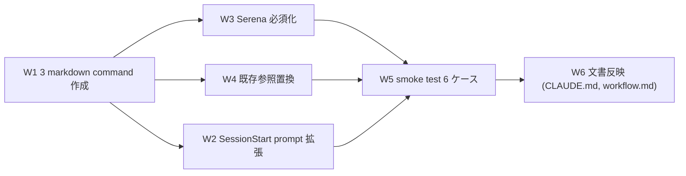

# Task #7: Custom PM / Session Commands (SC 系コマンド自前実装 + Serena 必須化)

> Status: **🔲 未着手** (W1-W6 残)
> 起案: 2026-05-12
> 関連: #6 (Loop Autonomous Discipline、本 task の前提)
> 設計起源: [`docs/draft/custom-pm-commands.md`](../draft/custom-pm-commands.md) (§8 で 2026-05-12 最終承認済)

## 背景・目的

HIRAI ハーネスは `/sc:save` `/sc:load` `/sc:pm` (SuperClaude plugin 由来) を session 永続化と PM orchestration に使用している。3 つの構造的問題:

1. **外部 plugin 依存**: 採用者が SuperClaude 未注入だと `Skill` 呼出 fail、中断耐性が機能しない
2. **portability 損失**: `.claude/` 単独移植時に plugin 未注入 risk、core value (`.claude/` 移植可能性) と衝突
3. **永続化曖昧**: Serena memory に書くか docs/temp/ に書くかが SuperClaude 内部実装依存、採用者から不透明

加えて user 指摘 (2026-05-12): SessionStart 時に user が「前回の続き」を毎回手動 `/sc:load` 入力する UX 改善余地。

→ 3 markdown command 自前実装 + Serena 必須化 + SessionStart resume prompt + 既存参照置換 で **5 つの改善** を同時達成する (draft §1 真因)。

## 仕様（要決定 → 決定済）

### Q1: コマンド名

| 案 | 内容 | 評価 |
|---|---|---|
| `/save-state` `/resume-state` `/orchestrate` | 動作が名前から自明、`/pm` 衝突回避 | **採用** (draft §3 推奨、user 承認済) |
| `/checkpoint` `/restore` `/pm` | 短い、しかし `/pm` 衝突リスク | 却下 |

### Q2: 実装範囲

| 案 | 内容 | 評価 |
|---|---|---|
| A 最小実装 | 3 command のみ、既存参照置換なし | 却下 (portability 改善不十分) |
| B フル強制 | 3 command + Serena 必須化 + 既存全置換 + SessionStart prompt + `.mcp.json` required marker | 採用方針 |
| **C ハイブリッド** | B + Wave 独立 deliver | **採用** — W1-W6 Wave 単位の検証分散 |

### Q3: Serena 必須化の実現方法

→ 2 段階:
- **第 1 段階**: 各 command 冒頭で `mcp__serena__check_onboarding_performed` 必須実行、未済時 error
- **第 2 段階 (検証要)**: `.mcp.json` `serena` entry に required marker (Claude Code 仕様確認後、不可なら第 1 段階のみ)

## 設計

### Wave 構成 (draft §3 と整合)

### W1 詳細: 3 markdown command

**`.claude/commands/save-state.md`** (`/sc:save` 後継):
- 各 Serena memory key (`session/context` / `session/last` / `session/checkpoint`) への `write_memory` 順序実行
- `docs/temp/` 一時ファイル整理 (オプション)
- 完了報告: "Session saved to Serena memory. Resume with /resume-state"

**`.claude/commands/resume-state.md`** (`/sc:load` 後継):
- `check_onboarding_performed` → 未済 error
- `activate_project` (project hash 自動)
- `list_memories` で `session/*` `plan/*` `learning/*` 存在確認
- 存在 key を逐次 `read_memory` 復元
- 復元レポート: 前回 / 進捗 / 次アクション / 課題 の 4 項目

**`.claude/commands/orchestrate.md`** (`/sc:pm` 後継):
- Session Start Protocol 4 step (check_onboarding / list_memories / request 分析 / subagent 委譲)
- PDCA cycle Plan/Do/Check/Act 各段階で `write_memory`

### W2 詳細: `mode-session-start.sh` 拡張

draft §3 W2 詳細参照。`~/.claude/projects/<hash>/memory/` の存在で resume prompt 注入。

### W3 詳細: Serena 必須化

- `.mcp.json` required marker 検討 (実装時 verify)
- 各 command 内で onboarding check 強制

### W4 詳細: 既存参照置換

対象 (draft §3 W4 詳細):
- `CLAUDE.md` Autonomous Progression / Commands テーブル / Implementation Status
- `.claude/rules/modes.md` 遵守事項 6 (3 箇所)
- `.claude/hooks/context-budget.sh` heredoc (4 箇所)
- `docs/draft/*.md` / `docs/tasks/*.md` / `~/.claude/projects/.../memory/*.md`

戦略: subagent に `replace_all` 委譲 (主要ファイル毎)、最後に `grep -r '/sc:(save|load|pm)' .` で 0 件確認。

## TDD 戦略

### RED (先に追加するテスト)

`.claude/tests/custom-pm-commands-smoke.sh` (新規):
- **Case 1**: `save-state` 実行 → mock Serena `write_memory("session/context", ...)` 呼び出し
- **Case 2**: `resume-state` 実行 → 書き込んだ memory を read 復元、復元レポートに 4 項目含む
- **Case 3**: Serena 不在環境 (`mcp__serena__*` 未注入) で各 command 実行 → graceful error message (exit 0 or 明示誘導)
- **Case 4**: `mode-session-start.sh` 実行: memory file 存在時 stdout に `<system-reminder>` + `/resume-state` 言及、不在時 silent
- **Case 5**: `grep -rE '/sc:(save|load|pm)' .` の結果が 0 件 (本 draft / 完了済 task ファイル除く)
- **Case 6**: 新コマンド呼び出し時、onboarding 未済なら早期 error 出力

### GREEN (最小実装)

- W1-W4 完了後に Case 1-6 順次実装
- 既存 smoke 全 PASS 維持 (workflow-guard 8/8 / next-actions-hooks 9/9 / loop-auto-progress 9/9)

### REFACTOR

- 3 command の共通処理 (onboarding check, project activate) を `.claude/commands/lib/_serena-helpers.md` 等に外部化検討 (後続セッション判断)

## Wave 構成

| Wave | 内容 | 工数 | 依存 | 状態 |
|:---:|:---|---:|:---|:---:|
| W1 | 3 markdown command 新設 (`.claude/commands/save-state.md` / `resume-state.md` / `orchestrate.md`) | 1.0h | — | 🔲 |
| W2 | `mode-session-start.sh` 拡張 (resume prompt) | 0.5h | W1 | 🔲 |
| W3 | Serena 必須化 (onboarding check + `.mcp.json` 検証) | 0.5h | W1 | 🔲 |
| W4 | 既存 `/sc:*` 参照置換 (CLAUDE.md / modes.md / context-budget.sh / docs / memory) | 0.7h | W1 | 🔲 |
| W5 | smoke test 6 ケース | 0.5h | W1, W3, W4 | 🔲 |
| W6 | 文書反映 (CLAUDE.md commands table / workflow.md セッション永続化セクション / next-actions #7 更新) | 0.3h | 全 Wave | 🔲 |

合計工数: **3.5h**

## 完了条件

- [ ] W1: 3 command file 新設、各 command が `mcp__serena__check_onboarding_performed` を初手で実行
- [ ] W2: `mode-session-start.sh` が前回 session memory 存在時に `<system-reminder>` で `/resume-state` 提案
- [ ] W3: `.mcp.json` required marker (可なら) + 全 command onboarding check 強制
- [ ] W4: `grep -rE '/sc:(save|load|pm)' .` が **0 件** (本 task draft / 完了済 task ファイル除く)
- [ ] W5: `.claude/tests/custom-pm-commands-smoke.sh` 6/6 PASS
- [ ] W6: CLAUDE.md / `.claude/rules/workflow.md` に新コマンド + Serena 必須化記載、`next-actions.md` entry #7 処理結果列更新
- [ ] PR #4 作成 + merge 後、次セッション SessionStart で `/resume-state` prompt 発火確認

## 工数見積

合計 **3.5h** (Wave 内訳: W1=1.0 / W2=0.5 / W3=0.5 / W4=0.7 / W5=0.5 / W6=0.3)。実装 90 分 + smoke 30 分 + 文書反映 30 分。

## 影響範囲

| 範囲 | 詳細 |
|---|---|
| ファイル | `.claude/commands/save-state.md` (新規) / `.claude/commands/resume-state.md` (新規) / `.claude/commands/orchestrate.md` (新規) / `.claude/hooks/mode-session-start.sh` (拡張) / `.claude/hooks/context-budget.sh` (heredoc 置換) / `.claude/rules/modes.md` (遵守事項 6 置換) / `CLAUDE.md` (Autonomous Progression / Commands table 置換) / `.mcp.json` (required marker 検討) / `.claude/tests/custom-pm-commands-smoke.sh` (新規) / `.claude/rules/workflow.md` (Session 永続化セクション追加) / `docs/draft/*.md` / `docs/tasks/*.md` / `~/.claude/projects/.../memory/*.md` (`/sc:*` 1:1 置換) |
| migration | なし |
| 環境変数 | 新規追加なし (既存 `HC_*` `ECC_*` の Serena 関連は要 verify) |
| 互換性 | SuperClaude 未注入環境でも `.claude/` 単独動作可能に変化 (本 task の core 効果)。既存 `/sc:save` 等の Skill 呼出は merge 後 broken (代替 `/save-state` 等に置換完了するため許容) |

## 再発防止

- Wave W5 Case 5 (`grep /sc:` 0 件確認) を smoke に固定 → 将来追加文書での `/sc:` 紛れ込み検出
- `.claude/rules/workflow.md` に「Session 永続化と PM Orchestration」セクション追加 → 採用者が同 pattern を再現可能
- next-actions entry #7 (`.claude/` 汎用化) を本 task で部分対応 → 残課題 (既存 `byproduct-discharge` セクションの `docs/draft/` 直リンク等) は task #7 完了後に再評価

## ステータスログ

| 日付 | 状態 | 備考 |
|---|---|---|
| 2026-05-12 | 起案 | 設計 draft `docs/draft/custom-pm-commands.md` 起案 (commit `ae7ac51`) |
| 2026-05-12 | 承認 | user「承認します。」明示承認 (draft §8 line 2) |
| 2026-05-12 | task 化 | `/new-task 7 custom-pm-commands` 起動、本ファイル生成 |

## 派生 task / 次アクション候補

このタスクの実装中・レビュー中・完了時に「これは別 task として管理すべき」と判断した副産物 (byproduct) を箇条書きで記入する。

### 義務 (development-process.md §「副産物発生時の即時 draft 起こし義務」準拠)

- 副産物発見の瞬間に **必ず本セクションに記入** (memory / 会話履歴に流すだけは禁止)
- task 完了 (`/finish-task`) 時、本セクションの全 entry が以下のいずれかに処理済:
  - (a) `docs/draft/<slug>.md` に draft 起こし済 (🔴 / 🟡)
  - (b) `docs/tasks/next-actions.md` に entry 追加済 (🟢)
  - (c) 無視 (commit message に理由記載)

### 記入欄

(現時点で空。W1-W6 実装中に発見した副産物を追記)

### 関連

- [`next-actions.md`](next-actions.md) — 本セクションと連動する registry
- [`.claude/rules/development-process.md`](../../.claude/rules/development-process.md) §「副産物発生時の即時 draft 起こし義務」

## 関連

- Draft: [`docs/draft/custom-pm-commands.md`](../draft/custom-pm-commands.md)
- 依存タスク: #6 (Loop Autonomous Discipline、本 task の前提)
- 派生タスク: (W1-W6 実装中に発見した場合追記)
- 関連 next-actions: #7 (`.claude/` 汎用化リファクタ — 本 task で部分対応)
