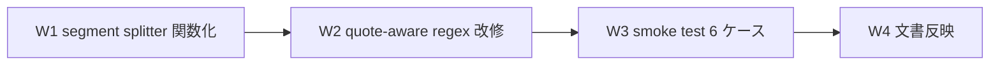

# Task #8: delegation-guard.sh heredoc segment splitter 修正

> Status: **🔲 未着手** (W1-W4 残)
> 起案: 2026-05-12
> 関連: #6 (Loop Autonomous Discipline、本 bug の発生現場の一部) / #7 (Custom PM / Session Commands、本 bug 修正 pattern 再適用候補)
> 設計起源: [`docs/draft/delegation-guard-heredoc-fix.md`](../draft/delegation-guard-heredoc-fix.md) (2026-05-12 承認済)

## 背景・目的

`.claude/hooks/delegation-guard.sh` の segment splitter (L139-144) は Bash コマンドを `&&` / `||` / `;` / `|` で分割し各セグメントを whitelist 照合する設計。awk gsub regex `gsub(/&&|\|\||;|\|/, "\n", $0)` が **`|` 単独文字も改行置換** するため、heredoc 内 / quoted string 内の `|` が separator 誤認 → whitelist 不一致 → 誤 BLOCK が発生する。

本セッションでも task #6 commit phase で再現確認。entry #8 として next-actions に記録、本セッション task #7 完了後に draft 起案 + user 承認 → 本 task 化。

## 仕様（要決定 → 決定済）

### Q1: 採用案

| 案 | 内容 | 評価 |
|---|---|---|
| A 最小 patch | gsub regex 改修のみ | 却下 (近似実装で残存 risk) |
| B フル parser | bash 自身で segment 取得 | 却下 (工数 2h、portability 確認要) |
| **C ハイブリッド** | A + 関数化 + smoke 6 cases | **採用** (draft §3 推奨、user 承認済) |

### Q2: Quote-aware の awk 実装方式

→ awk 1 行 stream で char-by-char に走査し `in_single` / `in_double` / `escape` 状態追跡。heredoc 本文は単行解析の限界で未対応 (制限事項明文化、B 移行で対応)。

## 設計

draft §3 W1-W4 と整合。

### W1 詳細: 関数化

`delegation-guard.sh` L139-144 を `split_command_segments` 関数 (subshell 隔離 `( ... )`, `set -uo pipefail`) に抽出。behavior preserving。

### W2 詳細: quote-aware regex

awk char-by-char 走査で in_single / in_double / escape 状態追跡。クォート外の `&&` `||` `;` `|` のみ separator として認識。詳細コード: draft §3 W2 参照。

### W3 詳細: smoke test 6 cases

`.claude/tests/delegation-guard-segment-smoke.sh` 新規作成。

| Case | 入力 | 期待 segments | 検証目的 |
|---|---|---|---|
| 1 | `git status && git diff` | 2 (`git status` / `git diff`) | 基本セパレータ `&&` |
| 2 | `git status ; git diff` | 2 (`git status` / `git diff`) | セパレータ `;` |
| 3 | `git status \| head -1` | 2 (`git status` / `head -1`) | パイプ `\|` |
| 4 | `git commit -m "table\|cell\|content"` | 1 (分割しない) | **core fix**: ダブルクォート内 `\|` 保護 |
| 5 | `git commit -m 'A \|\| B'` | 1 (分割しない) | シングルクォート内 `\|\|` 保護 |
| 6 | `echo \\&& bar; echo foo` | 2 (`echo \\&& bar` / `echo foo`) | escape 後 `&&` 保護 + `;` 分割 |

### W4 詳細: 文書反映

`.claude/rules/development-process.md` §「サブエージェント委譲」末尾に heredoc / quoted string 保護の注意書き 1 段落追加。`delegation-guard.sh` L139 付近のコメントを quote-aware ロジック説明に更新。

## TDD 戦略

### RED (先に追加するテスト)

W3 で 6 cases を smoke test として実装。各 case で実 split 結果と期待値を比較。

### GREEN (最小実装)

- W1: 関数化 (behavior preserving) → 既存挙動維持確認 (Case 1-3)
- W2: quote-aware regex 改修 → Case 4-6 新規 PASS
- 既存 smoke (custom-pm-commands-smoke / loop-auto-progress-smoke / workflow-guard 等) 全 PASS 維持

### REFACTOR

- W2 awk 実装の char-by-char ループを別関数化検討 (本 task scope 外、後続セッション判断)
- B フル shell parser 化への移行 path は W1 関数化で確保済

## Wave 構成

| Wave | 内容 | 工数 | 依存 | 状態 |
|:---:|:---|---:|:---|:---:|
| W1 | `delegation-guard.sh` segment splitter 関数化 (behavior preserving) | 0.2h | — | 🔲 |
| W2 | quote-aware awk regex 改修 (in_single / in_double / escape 追跡) | 0.4h | W1 | 🔲 |
| W3 | `.claude/tests/delegation-guard-segment-smoke.sh` 新規 6 cases + 6/6 PASS | 0.3h | W1, W2 | 🔲 |
| W4 | `.claude/rules/development-process.md` + `delegation-guard.sh` コメント更新 | 0.1h | W2 | 🔲 |

合計工数: **1.0h**

## 完了条件

- [ ] W1 `split_command_segments` 関数抽出済 (subshell 隔離 + 既存 regex)
- [ ] W2 quote-aware awk regex 実装 (in_single / in_double / escape 追跡)
- [ ] W3 smoke 6/6 PASS (`.claude/tests/delegation-guard-segment-smoke.sh`)
- [ ] W4 `.claude/rules/development-process.md` §「サブエージェント委譲」に heredoc 保護注意書き
- [ ] 既存 smoke 全 PASS (workflow-guard 8/8 / next-actions-hooks 9/9 / loop-auto-progress 9/9 / custom-pm-commands 6/6)
- [ ] 既存 hook 正常コマンド受理動作の regression 0 件
- [ ] PR 作成 (user 承認後、task #6 / #7 push と統合検討)

## 工数見積

合計 **1.0h** (W1=0.2 / W2=0.4 / W3=0.3 / W4=0.1)。実装 30 分 + smoke 20 分 + 文書 10 分。task #7 (3.5h 見積→実 7 分実績) の前例より、subagent 並列性で短縮可能性あり。

## 影響範囲

| 範囲 | 詳細 |
|---|---|
| ファイル | `.claude/hooks/delegation-guard.sh` (関数抽出 + regex 改修 + コメント) / `.claude/tests/delegation-guard-segment-smoke.sh` (新規) / `.claude/rules/development-process.md` (注意書き追加) |
| migration | なし |
| 環境変数 | 追加なし |
| 互換性 | 既存正常コマンドの受理動作は保持 (W3 Case 1-3 で検証)、quoted/heredoc 内 `\|` の保護動作が新規追加 (W3 Case 4-6 で検証)。動作変更は **誤 BLOCK 解消方向のみ** (false positive を false negative に変えない) |

## 再発防止

- W3 smoke 6 cases を `.claude/tests/` に固定 → 将来 regex 改修時の regression 検出
- `learning/solutions/delegation-guard-quote-aware-split` Serena memory に永続化 (本 task 完了時)
- 制限事項 (heredoc 本文 / ANSI-C quoting) を draft §3 W2 制限事項として明文化 → B フル parser 化の必要時に参照

## ステータスログ

| 日付 | 状態 | 備考 |
|---|---|---|
| 2026-05-12 | 起案 | next-actions entry #8 → draft 起案 (`docs/draft/delegation-guard-heredoc-fix.md`) |
| 2026-05-12 | 承認 | user「承認します。」明示承認 (draft §8) |
| 2026-05-12 | task 化 | `/new-task 8 delegation-guard-heredoc-fix` 起動、本ファイル生成 |

## 派生 task / 次アクション候補

このタスクの実装中・レビュー中・完了時に「これは別 task として管理すべき」と判断した副産物 (byproduct) を箇条書きで記入する。

### 義務 (development-process.md §「副産物発生時の即時 draft 起こし義務」準拠)

- 副産物発見の瞬間に **必ず本セクションに記入** (memory / 会話履歴に流すだけは禁止)
- task 完了 (`/finish-task`) 時、本セクションの全 entry が以下のいずれかに処理済:
  - (a) `docs/draft/<slug>.md` に draft 起こし済 (🔴 / 🟡)
  - (b) `docs/tasks/next-actions.md` に entry 追加済 (🟢)
  - (c) 無視 (commit message に理由記載)

### 記入欄

(現時点で空。W1-W4 実装中に発見した副産物を追記)

### 関連

- [`next-actions.md`](next-actions.md) — 本セクションと連動する registry
- [`.claude/rules/development-process.md`](../../.claude/rules/development-process.md) §「副産物発生時の即時 draft 起こし義務」

## 関連

- Draft: [`docs/draft/delegation-guard-heredoc-fix.md`](../draft/delegation-guard-heredoc-fix.md)
- 依存タスク: #6 (Loop Autonomous Discipline、本 bug の発生現場) / #7 (Custom PM / Session Commands、本 bug 修正 pattern 再適用候補)
- 派生タスク: (W1-W4 実装中に発見した場合追記)
- 関連 next-actions entry: #8 (起源)
