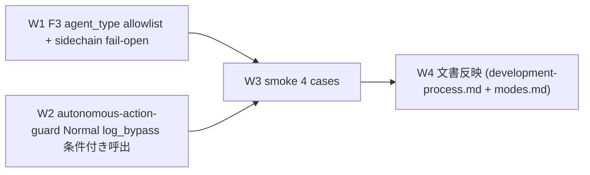

# Task #9: Harness Audit Followups — F3 confidence regex 改善 + mode-switch bypass log 化

> Status: **🔲 未着手** → **🔄 進行中** → **✅ 完了**
> 起案: 2026-05-13
> 関連: #6, #8 / Phase harness-audit-followups
> 設計起源: [harness-audit-followups.md](../draft/harness-audit-followups.md)

## 背景・目的

本セッション末の `/harness-audit` 実行で 2 件の改善候補が観察された:

1. **F3 confidence-gate.sh** に SubagentStop hook が agent_type を問わず全 stop event で fire し、軽量 sidechain (Task tool query / tool-use only) で 96 件の `regex_no_match` 累計が積み上がっている。意図的に起動した major subagent (`general-purpose` + `run_in_background`) のみ confidence 自己評価必須にすべきだが、現状は両者を区別できていない。
2. **autonomous-action-guard.sh** の Normal モード分岐は `additionalContext` warning のみで `log_bypass` 呼出を行わない。本セッションで採用された「mode.yml 一時切替 → push」path は `.claude/.workflow-state/bypass.log` 対象外で監査トレース不能。

user 明示承認 (2026-05-13「1,2 を調査から実施してください」) を受け、両改修を W1-W4 で完遂する。

## 仕様（要決定 → 決定済）

### Q1: F3 regex_no_match 削減方針

| 案 | 内容 | 評価 |
|---|---|---|
| A | regex variant 拡張 | 真因は variant 不足ではなく hook 発火範囲、的外れ |
| B | `transcript_chars < N` で fail-open | 閾値の安全性検証必要、major subagent でも短い時に誤 exempt |
| **C** | `agent_type` allowlist + sidechain detection で major subagent only block | precision 高、軽量 sidechain noise 除去 |

→ **C** 採用。`general-purpose` / `Explore` / `Task` allowlist or `is_sidechain==path_subagents` を major subagent と判定。

### Q2: autonomous-action-guard Normal モード log 化方針

| 案 | 内容 | 評価 |
|---|---|---|
| A | Normal 分岐全 push を log | noise 多 |
| B | mode.yml Edit 時 PostToolUse hook | scope 拡大、新規 hook 追加 |
| **C** | 禁止パターン match 時のみ log_bypass 呼出 | 「Loop 規律から外れた cmd」のみ記録、noise 低 |

→ **C** 採用。`HC_AUTONOMOUS_LOG_NORMAL_RESTRICTED` env で OFF 可。

## 設計

### Wave 構成

### W1 詳細

- 対象: `.claude/hooks/confidence-gate.sh`
- 変更: L143 (transcript path 取得直前) に `agent_type` 抽出を追加、L267-289 の `regex_no_match` block 前に major subagent 判定 (`allowlist match` or `is_sidechain==path_subagents`) を実装。major subagent でなければ fail-open + `log_failure "skipped_minor_sidechain"`
- env: `HC_CONFIDENCE_MAJOR_AGENT_ONLY=false` で従来動作復帰

### W2 詳細

- 対象: `.claude/hooks/autonomous-action-guard.sh`
- 変更: L204-213 `*)` (Normal モード) 分岐に `log_bypass "autonomous-action-guard" "mode-normal-restricted-cmd" "matched=... segment=..."` を追加
- env: `HC_AUTONOMOUS_LOG_NORMAL_RESTRICTED=false` で OFF

### W3 詳細

- 新規: `.claude/tests/audit-followups-smoke.sh` (4 cases)
- Case 1: F3 fail-open for minor sidechain
- Case 2: F3 block 維持 for `general-purpose`
- Case 3: autonomous-action-guard Normal logs restricted cmd
- Case 4: autonomous-action-guard Loop blocks restricted cmd
- `set -euo pipefail` は subshell 関数化で局所化 (feedback_set_e_in_sourced_libs 規範遵守)

### W4 詳細

- `.claude/rules/development-process.md` F3 confidence-gate Bypass 直前に「major subagent only block (2026-05-13、task #9)」段落追加
- `.claude/rules/modes.md` 遵守事項 8 bypass 説明部分に「mode-switch bypass の log」1 行追加

## TDD 戦略

### RED（先に追加するテスト）

- `.claude/tests/audit-followups-smoke.sh`
  - Case 1: F3 fail-open
  - Case 2: F3 block 維持
  - Case 3: autonomous-action-guard Normal logs
  - Case 4: autonomous-action-guard Loop blocks

### GREEN（最小実装）

- `.claude/hooks/confidence-gate.sh`: agent_type 抽出 + major subagent 判定 + fail-open
- `.claude/hooks/autonomous-action-guard.sh`: Normal 分岐 log_bypass 条件付き呼出

### REFACTOR

- 不要 (surgical change、scope 外触らない)

## Wave 構成

| Wave | 内容 | 工数 | 依存 |
|:---:|:---|---:|:---|
| W1 | F3 agent_type allowlist + sidechain fail-open | 0.4h | — |
| W2 | autonomous-action-guard Normal log_bypass 条件付き呼出 | 0.3h | — |
| W3 | smoke test 4 cases | 0.5h | W1, W2 |
| W4 | 文書反映 (development-process.md + modes.md) | 0.2h | W1, W2 |

合計工数: 1.4h

## 完了条件

- [ ] W1: `.claude/hooks/confidence-gate.sh` に agent_type allowlist + sidechain fail-open ロジック実装
- [ ] W2: `.claude/hooks/autonomous-action-guard.sh` Normal 分岐 log_bypass 条件付き呼出
- [ ] W3: `.claude/tests/audit-followups-smoke.sh` 4/4 PASS
- [ ] W3: 既存 smoke (workflow-guard 8/8 / next-actions 9/9 / loop-auto-progress 9/9 / custom-pm 6/6 / delegation-guard-segment 6/6) 全 PASS、regression 0
- [ ] W4: `.claude/rules/development-process.md` + `.claude/rules/modes.md` 反映
- [ ] commit hashes が list.md に記録される

## 工数見積

合計 1.4h (W1=0.4 / W2=0.3 / W3=0.5 / W4=0.2)。task #8 (1.0h 見積→実 3.8 分) の前例より短縮可能性あり。

## 影響範囲

| 範囲 | 詳細 |
|---|---|
| ファイル | `.claude/hooks/confidence-gate.sh`, `.claude/hooks/autonomous-action-guard.sh`, `.claude/tests/audit-followups-smoke.sh`, `.claude/rules/development-process.md`, `.claude/rules/modes.md`, `docs/tasks/list.md` |
| migration | なし |
| 環境変数 | `HC_CONFIDENCE_MAJOR_AGENT_ONLY` (default true), `HC_AUTONOMOUS_LOG_NORMAL_RESTRICTED` (default true) 新設 |
| 互換性 | 後方互換 (env で従来動作復帰可) |

## 再発防止

- /harness-audit で `regex_no_match` 累計が major subagent 由来のみに絞られることを 1 週間運用後に再確認
- mode-switch bypass が bypass.log に残ることで「Loop 規律から外れた操作」のトレーサビリティが確立

## ステータスログ

| 日付 | 状態 | 備考 |
|---|---|---|
| 2026-05-13 | 起案 | 設計 draft `docs/draft/harness-audit-followups.md` |
| 2026-05-13 | 承認 | user 「実施してください」 |
| 2026-05-13 | 着手 | branch `feat/loop-mode` |

## 派生 task / 次アクション候補

- なし (現時点で副産物想定なし、発見されれば `docs/tasks/next-actions.md` に追記)

## 関連

- Draft: [harness-audit-followups.md](../draft/harness-audit-followups.md)
- 依存タスク: #6 (autonomous-action-guard 起源), #8 (delegation-guard、同 hook 群)
- 派生タスク: (なし)
